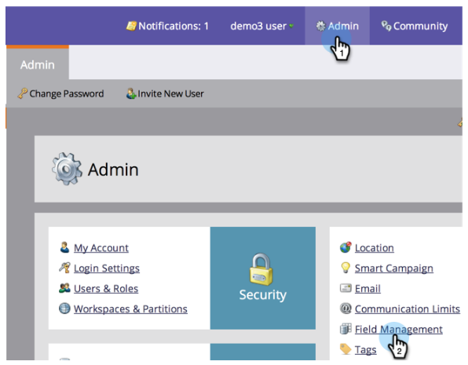
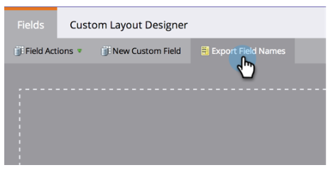

# Exportera en lista med alla Marketo API-fältnamn {#export-a-list-of-all-marketo-api-field-names}

Om du använder vårt SOAP API eller Munchkin API behöver du en lista med alla fält och deras API-namn. Så här hämtar du den här listan.

>[!NOTE]
>
>**Administratörsbehörigheter krävs**

1. Gå till **Admin** och klicka på **Fälthantering**.

   

1. Klicka på **Exportera fältnamn** för att hämta kalkylbladet.

   

Snyggt! Du har nu ett kalkylblad med en lista över alla fält och deras API-namn.

>[!NOTE]
>
>Teckengränsen för MLM API-namn är 255.
