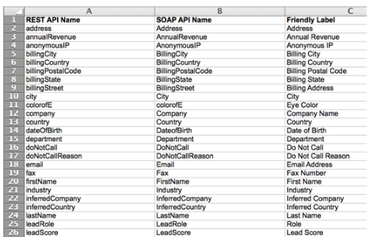

# Exportera en lista med alla Marketo API-fältnamn {#export-a-list-of-all-marketo-api-field-names}

Om du använder [!DNL SOAP API] eller [!DNL Munchkin API] behöver du en lista över alla fält och deras API-namn. Så här hämtar du den här listan.

>[!NOTE]
>
>**Administratörsbehörigheter krävs**

1. Gå till området **[!UICONTROL Admin]**.

   

1. Klicka på **[!UICONTROL Field Management]**.

   

1. Klicka på **[!UICONTROL Export Field Names]** om du vill hämta kalkylbladet.

   

Snyggt! Du har nu ett kalkylblad med en lista över alla fält och deras API-namn.

>[!NOTE]
>
>Teckengränsen för MLM API-namn är 255.
