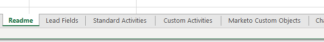

# Exportera alla objektmetadata {#export-all-object-metadata}

Med den här funktionen kan du exportera alla objekt och deras metadata.

>[!NOTE]
>
>**Administratörsbehörigheter krävs**

## Objekt {#objects}

* Leadfält (person/företag)
* Anpassade Marketo-objekt
* Standardaktiviteter
* Anpassade aktiviteter
* Kanaler
* Taggar

## Exportera objektmetadata {#export-object-metadata}

1. I My Marketo klickar du på **Admin**.

   

1. Välj **Fälthantering**.

   

1. Klicka på **Exportera alla objekt**.

   

>[!NOTE]
>
>Kontrollera att webbläsaren inte blockerar popup-fönster från Marketo.

Data exporteras som en CSV-fil.

