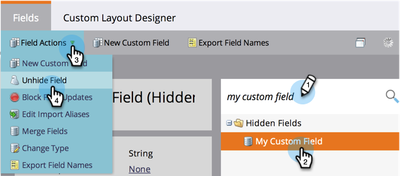

# Dölj och visa ett fält {#hide-and-unhide-a-field}

Om du inte längre har använt för ett fält i Marketo kan du dölja det från användargränssnittet så att det inte längre visas i programmet.

## Dölj ett fält {#hide-a-field}

>[!NOTE]
>
>**Administratörsbehörigheter krävs**

1. Gå till **Admin** och klicka på **Fälthantering**.

   

1. Sök efter fältet, markera det och klicka sedan på **Dölj fält** under &lt;a0/>Fältåtgärder **.**

   

   >[!NOTE]
   >
   >**Påminnelse**
   >
   >För att dölja ett fält får det inte vara kopplat till några andra resurser (inklusive arkiverade sådana). Se till att du tar bort fältet från alla smarta listor, val av flödessteg, formulär, e-post osv. innan du döljer det.

   Bekräfta genom att klicka på Dölj.
   

   Snyggt jobbat! Nu vet du hur du döljer ett fält i Marketos användargränssnitt.

   

## Visa ett fält {#unhide-a-field}

1. Gå till **Admin** och klicka på **Fälthantering**.

   

1. Sök efter och markera fältet och klicka sedan på **Fältåtgärder** under **`Unhide Field`**.

   

   Bra jobbat! Nu vet du hur du visar fält och gör dem synliga igen i Marketos användargränssnitt.

   >[!TIP]
   >
   >Behöver du gömma/visa massvis? Kontakta Marketo Professional Services: [`[email protected]`](http://docs.marketo.com/cdn-cgi/l/email-protection#4d3e283f3b242e283e0d202c3f26283922632e222063)

