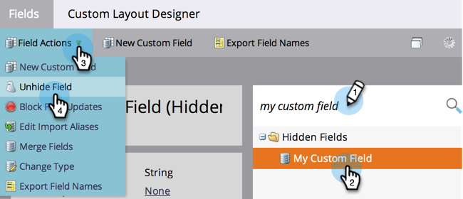

# Dölja och visa ett fält {#hide-and-unhide-a-field}

Om du inte längre använder ett fält i Marketo kan du dölja det från användargränssnittet så att det inte längre visas i programmet.

## Dölj ett fält {#hide-a-field}

>[!NOTE]
>
>**Administratörsbehörigheter krävs**

1. Gå till **[!UICONTROL Admin]** område.

   

1. Klicka på **[!UICONTROL Field Management]**.

   

1. Sök efter fältet, markera det och sedan under **[!UICONTROL Field Actions]** klicka **[!UICONTROL Hide Field]**.

   

   >[!NOTE]
   >
   >För att dölja ett fält får det inte vara kopplat till några andra resurser (inklusive arkiverade sådana). Se till att du tar bort fältet från alla smarta listor, val av flödessteg, formulär, e-post osv. innan du döljer det.

1. Klicka **[!UICONTROL Hide]** för att bekräfta.

   

   Snyggt jobbat! Nu vet du hur du döljer ett fält i Marketo användargränssnitt.

   

## Visa ett fält {#unhide-a-field}

1. Gå till **[!UICONTROL Admin]** område.

   

1. Klicka på **[!UICONTROL Field Management]**.

   

1. Sök och markera fältet. I [!UICONTROL Field Actions] nedrullningsbar meny, klicka **[!UICONTROL Unhide Field]**.

   

   Bra jobbat! Nu vet du hur du visar fält och gör dem synliga igen i Marketo användargränssnitt.

   >[!TIP]
   >
   >Behöver du gömma/visa massvis? Kontakta Marketo Professional Services: services@marketo.com.
