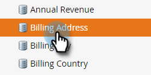

# Markera ett fält som känsligt {#mark-a-field-as-sensitive}

Som Marketo-administratör kan du markera ett specifikt fält som&quot;känsligt&quot; så att dess värden aldrig fylls i i i förväg, vilket skyddar användarnas känsliga data.

>[!NOTE]
>
>Den här funktionen aktiveras för alla Marketo-förekomster tisdagen den 11 maj.

1. Klicka på **Admin**.

   

1. Klicka på **Fälthantering**.

   

1. Sök efter och markera önskat fält.

   

1. Markera kryssrutan **Markera fält som känsligt**.

   

Och det är allt! Framöver kommer inga Marketo-formulär som har aktiverats med förifyllning att visa data för det markerade fältet.
