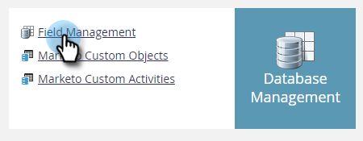

# Markera ett fält som känsligt {#mark-a-field-as-sensitive}

Som Marketo-administratör kan du markera ett specifikt fält som&quot;känsligt&quot; så att dess värden aldrig fylls i i i förväg, vilket skyddar användarnas känsliga data.

1. Klicka på **[!UICONTROL Admin]**.

   

1. Klicka på **[!UICONTROL Field Management]**.

   

1. Sök efter och markera önskat fält.

   

1. Markera kryssrutan **[!UICONTROL Mark Field as Sensitive]**.

   
