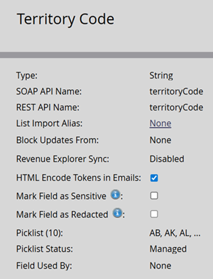

# Hantering av plocklistor {#picklist-management}

Med Picklist-hantering kan du definiera en fast uppsättning värden för ett fält för att förenkla hanteringen av data och arbetsflöden i Marketo Engage. Endast icke-textfält som inte är mappade till ett CRM-fält med en definierad lista kan hanteras i Marketo. Om ett fält mappas till ett CRM-fält som har en definierad lista måste värdena för det fältet definieras i CRM.

Du kan se statusen för en plocklista från sidan Fälthantering. Ett fält kan ha någon av följande plocklistesstatusar:

* **Hanterad**: En användare har definierat värdeuppsättningen som kan föreslås automatiskt för det här fältet. Endast värden som definieras i fälthantering föreslås automatiskt. Om en hanterad plocklista tas bort återgår plocklistans status till det ursprungliga värdet för fältet, antingen Ohanterat eller Seeded.

* **Ohanterad**: Möjliga värden för det här fältet har inte definierats. Värden föreslås automatiskt baserat på de som finns i fälten i databasen.

* **Seeded**: Fältet har en systemdefinierad lista med värden som är föreslagna för användaren.

* **CRM**: Fältet har ett värde som definieras av CRM-systemet, Salesforce.com eller Microsoft Dynamics, som synkroniseras med instansen.

  

## Hantera plocklista {#manage-picklist}

Om du vill ändra värdena för ett fält går du till **Admin** > **Fälthantering** och markerar det önskade fältet.

Klicka på listrutan _Fältåtgärder_ och välj **Hantera plocklista**.

I dialogrutan _Hantera plocklista_ kan du lägga till, redigera eller ta bort värden. Du kan även ta bort den hanterade plocklistan för att återställa fältet till dess ursprungliga plocklistesstatus, antingen _Ohanterad_ eller _Avancerad_.

Varje plocklistepost har ett visningsvärde och ett skickat värde. Visningsvärdet är vad användaren föreslår när han eller hon skapar smarta listor, smarta kampanjer eller formulär, medan det skickade värdet är det som lagras. Exempel: i ditt användningsfall för Territoriets kod kan det fullständiga namnet på ett område (t.ex. Alberta) föreslås medan koden med två bokstäver (AB) lagras.

## Automatiskt föreslå {#autosuggest}

När inställningen _Managed Picklist_ är aktiverad föreslår Filter, Flow Step Choices och Change Data Value automatiskt värden från den hanterade plocklistan. När den här inställningen är inaktiverad föreslås bara ohanterade värden.

### Växla mellan hanterade och ohanterade plocklistor {#switching}

De flesta prenumerationer på Marketo Engage innehåller data från innan Managed Picklists introducerades. Om du vill använda värden i smarta listor eller flödessteg från den här listan med ohanterade versioner (t.ex. från den fullständiga uppsättningen värden som finns i poster i din databas), växlar du inställningen Hanterad plocklista i den smarta listan eller Campaign-vyn. När du aktiverar det här alternativet visas endast de hanterade värdena i listan. När du stänger av den används den ohanterade listan och värden föreslås automatiskt baserat på befintliga värden i databasen.

## Formulärväljare (välj textfält) {#form-picklists}

Precis som Seeded- och CRM-Managed Picklists, sprids värdena för Managed Picklists till Forms när du använder fälttypen Select. För ett fält med en hanterad lista väljer du det fältet och ställer in fälttypen på _Select_.

Här visas uppsättningen med hanterade plocklistevärden som har definierats för det fältet.

