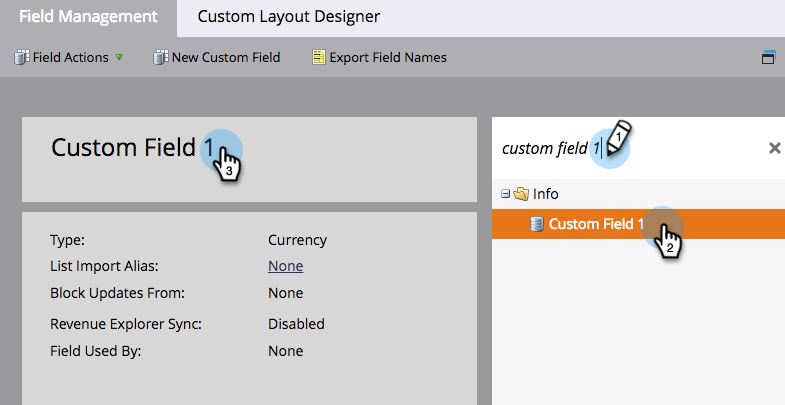
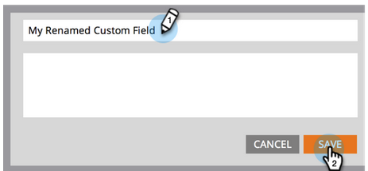

# Byta namn på ett fält {#rename-a-field}

>[!NOTE]
>
>Du kan byta namn på ett anpassat fält i Marketo, men det finns en hake: du måste ta bort all användning i systemet innan du gör det. Detta inkluderar formulär, smarta listor och smarta kampanjer.

>[!NOTE]
>
>**Administratörsbehörigheter krävs**

1. Gå till **[!UICONTROL Admin]** område.

   

1. Klicka på **[!UICONTROL Field Management]**.

   

1. Sök efter och markera det fält som du vill byta namn på och klicka sedan på fältnamnet på arbetsytan.

   

   >[!TIP]
   >
   >Klicka på **[!UICONTROL Used By]** om du vill söka efter resurser som refererar till det här fältet.

1. Byt namn på fältet och klicka **[!UICONTROL Save]**.

   

Snyggt jobb! Nu vet du hur du byter namn på fält i Marketo.

>[!CAUTION]
>
>Om du byter namn på API-namnet i Salesforce skapar Marketo ett helt nytt fält och lämnar det gamla kvar!
