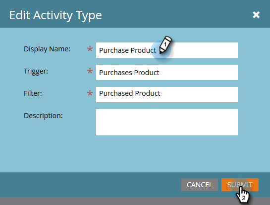

# Redigera en anpassad aktivitet {#edit-a-custom-activity}

Behöver du ändra en anpassad aktivitet som du redan har skapat? Så här gör du.

1. Klicka på **Admin**.

   

1. Klicka på **Anpassade aktiviteter** i **Databashantering**.

   

1. Välj den anpassade aktivitet som du vill redigera.

   

1. Klicka på **Anpassade aktivitetsåtgärder** och välj **Redigera aktivitet**.

   

   Redigera aktivitetstyp visas. I det här exemplet åtgärdar vi ett stavfel.

   

1. Ange din nya information och klicka på **Skicka**.

   

   Din anpassade aktivitet har nu redigerats!

   >[!NOTE]
   >
   >Om din aktivitet var ett utkast vid redigeringen är det fortfarande ett utkast. Om den publicerades ändras statusen till Publicerad med utkast.

