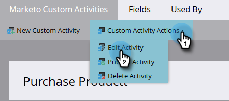

# Redigera en anpassad aktivitet {#edit-a-custom-activity}

Behöver du göra ändringar i en anpassad aktivitet som du redan har skapat? Så här gör du.

1. Gå till området **[!UICONTROL Admin]**.

   

1. Klicka på **[!UICONTROL Marketo Custom Activities]**.

   

1. Välj den anpassade aktivitet som du vill redigera.

   

1. Klicka på **[!UICONTROL Custom Activity Actions]** och välj **[!UICONTROL Edit Activity]**.

   

   Redigera aktivitetstyp visas. I det här exemplet åtgärdar vi ett stavfel.

   

1. Ange din nya information och klicka på **[!UICONTROL Submit]**.

   

   Din anpassade aktivitet har nu redigerats!

   >[!NOTE]
   >
   >Om din aktivitet var ett utkast vid redigeringen är det fortfarande ett utkast. Om den publicerades ändras statusen till Publicerad med utkast.
