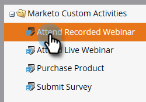

# Publicera en anpassad aktivitet {#publish-a-custom-activity}

Du har din anpassade aktivitet precis som du vill ha den. Nu är det dags att publicera det!

1. Gå till **Administratör** område.

   

1. Klicka **Marketo anpassade aktiviteter**.

   

1. Välj den anpassade aktivitet som du vill publicera.

   

1. Klicka på **Anpassade aktivitetsåtgärder** nedrullningsbar meny och välj **Publicera aktivitet**.

   

   Du kommer att se status för din anpassade aktivitet från Utkast..

   

   ...till publicerad.

   

   Snyggt gjort!
