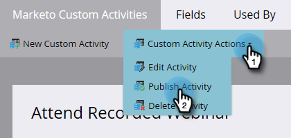

# Publicera en anpassad aktivitet {#publish-a-custom-activity}

Du har din anpassade aktivitet precis som du vill ha den. Nu är det dags att publicera det!

1. Gå till **[!UICONTROL Admin]** område.

   

1. Klicka på **[!UICONTROL Marketo Custom Activities]**.

   

1. Välj den anpassade aktivitet som du vill publicera.

   

1. Klicka på **[!UICONTROL Custom Activity Actions]** nedrullningsbar meny och välj **[!UICONTROL Publish Activity]**.

   

   Du kommer att se dina anpassade aktiviteters [!UICONTROL state] gå från [!UICONTROL Draft]...

   

   ...till [!UICONTROL Published].

   

   Snyggt gjort!
