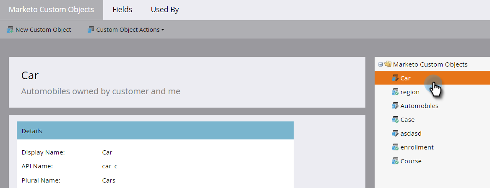
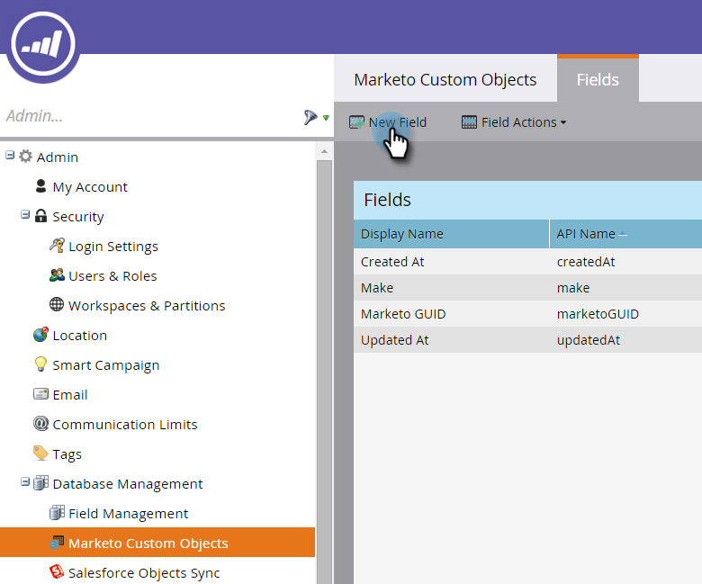
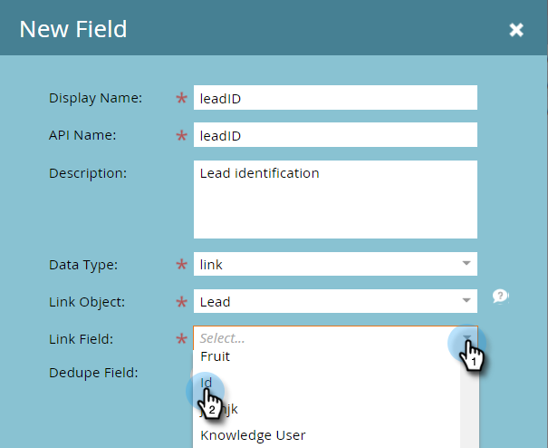

# Lägg till markering i anpassade objektlänkfält {#add-marketo-custom-object-link-fields}

När du skapar anpassade objekt måste du tillhandahålla länkfält för att kunna koppla den anpassade objektposten till rätt överordnade post.

* Om du vill ha en anpassad struktur som är en för många använder du länkfältet i det anpassade objektet för att ansluta det till en person eller ett företag.
* För många-till-många-strukturer använder du två länkfält som är anslutna från ett separat skapat mellanliggande objekt (som också är en typ av anpassat objekt). En länk ansluter till personer eller företag i din databas och den andra ansluter till det anpassade objektet. I det här fallet finns inte länkfältet i det anpassade objektet.

## Skapa ett länkfält för en 1:N-struktur {#create-a-link-field-for-a-one-to-many-structure}

Så här skapar du ett länkfält i ett anpassat objekt för en 1:N-struktur.

1. Klicka på **Admin** och välj **Marketo-anpassade objekt** i **Databashantering**.

   

1. Markera det anpassade objektet i listan.

   

1. Klicka på **Nytt fält** på fliken **Fält**.

   

1. Namnge länkfältet och lägg till en valfri beskrivning. Var noga med att välja datatypen Link.

   

   >[!CAUTION]
   >
   >Du kan inte gå tillbaka och skapa, redigera eller ta bort en länk eller ett borttagningsfält när det anpassade objektet har godkänts.

1. Ange om läntobjektet är för ett lead (person) eller ett företag.

   

   >[!NOTE]
   >
   >Om du väljer lead visas ID, e-postadress och eventuella anpassade fält i listan.
   >
   >
   >Om du väljer företag visas ID och eventuella anpassade fält i listan.

1. Markera det länkfält som du vill ansluta till som överordnat fält för det nya fältet.

   

   >[!NOTE]
   >
   >Endast strängfälttyper stöds i länkfältet.

1. Klicka på **Spara.**

   

## Skapa ett länkfält för en många-till-många-struktur {#create-a-link-field-for-a-many-to-many-structure}

Så här skapar du ett länkfält i ett mellanliggande objekt som kan användas i en många-till-många-struktur.

>[!PREREQUISITES]
>
>Du måste redan ha skapat mellanliggande objekt och eventuella anpassade objekt som du vill länka det till.

1. Klicka på **Admin** och välj **Marketo-anpassade objekt** i **Databashantering**.

   

1. Markera det mellanliggande objekt som du vill lägga till fältet i.

   

1. Klicka på **Nytt fält** på fliken **Fält **.

   

1. Du måste skapa två länkfält. Skapa dem en åt gången. Ge först fältet ett namn för medlemmarna i databaslistan (till exempel leadID). Lägg till en valfri beskrivning. Var noga med att välja länkdatatypen.

   

   >[!CAUTION]
   >
   >Du kan inte gå tillbaka och skapa, redigera eller ta bort en länk eller ett borttagningsfält när det anpassade objektet har godkänts.

1. Välj läntobjektet från databasen, i det här fallet Lead.

   

1. Markera det länkfält som du vill ansluta till, i det här fallet, ID.

   

   >[!NOTE]
   >
   >Endast strängfälttyper stöds i länkfältet.

1. Klicka på **Spara.**

   

1. Upprepa den här processen för den andra länken till ditt anpassade objekt, i det här exemplet, kursID. Länkobjektnamnet blir kurs och länkfältet blir kursID. Eftersom du redan har skapat och godkänt det anpassade kursobjektet är dessa val tillgängliga i listrutorna.

   

1. Skapa andra fält som du vill använda i mellanliggande objekt, till exempel enrollmentID eller grad.

## Använda anpassade objekt {#using-custom-objects}

Nästa steg är att använda dessa anpassade objekt i filter i smarta kampanjer. Med många-till-många-relationer kan du markera flera personer/företag och flera anpassade objekt. I exemplet nedan listas alla i din databas som uppfyller dessa villkor. Fältet för lärarnamn kommer från det anpassade kursobjektet och registreringsklassen kommer från det mellanliggande objektet.

>[!NOTE]
>
>**Relaterade artiklar**
>
>* [Lägg till markering i anpassade objektfält](add-marketo-custom-object-fields.md)
>* [Redigera och ta bort ett markeringsobjekt till anpassat objekt](edit-and-delete-a-marketo-custom-object.md)
>* [Förstå anpassade objekt i Marketo](understanding-marketo-custom-objects.md)
>* [Redigera och ta bort markering i anpassade objektfält](edit-and-delete-marketo-custom-object-fields.md)

>

