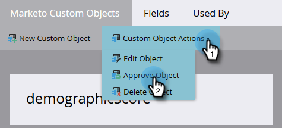

# Godkänn ett anpassat objekt {#approve-a-custom-object}

Du måste godkänna ett anpassat objekt innan du kan använda det. Processen skiljer sig något mellan nya anpassade objekt och objekt som du har redigerat.

## Godkänn ett nytt anpassat objekt {#approve-a-new-custom-object}

Du har skapat ett helt nytt anpassat objekt. Så här godkänner du det.

1. Gå till **Administratör** område.

   

1. Klicka **Anpassade Marketo-objekt**.

   

1. Markera ett objekt som är i utkastläge.

   

1. Klicka på **Anpassade objektåtgärder** nedrullningsbar meny och välj **Godkänn objekt**.

   

1. Läget ändras till Godkänd.

   

   >[!NOTE]
   >
   >Ett anpassat objekt som används i en _en-till-många-struktur_ måste ha minst ett dedupliceringsfält, ett länkfält, ett länkat objektnamn och ett länkat fältnamn som ska godkännas.
   >
   >Ett anpassat objekt som används i en _många-till-många-struktur_ **inte** behöver ett länkfält, ett länkat objektnamn eller ett länkat fältnamn när du godkänner det (eftersom de finns i det mellanliggande objektet).
   >
   >Ett anpassat objekt som används som _intermediärt objekt_ kräver ett länkfält, ett länkat objektnamn och ett länkat fältnamn men **inte** kräver ett dedupliceringsfält.
   >
   >Se [Förstå anpassade Marketo-objekt](/help/marketo/product-docs/administration/marketo-custom-objects/understanding-marketo-custom-objects.md) för mer information.

Så ja! Nu kan du välja det anpassade objektet i begränsningarna för filter och utlösare som ska användas i dina kampanjer.

## Godkänn ett redigerat anpassat objekt {#approve-an-edited-custom-object}

När du har redigerat ett godkänt anpassat objekt måste du godkänna utkastet för att kunna återställa det anpassade objektet till läget Godkänd.

1. När du redigerar ett anpassat objekt som redan godkänts får det ett godkänt med utkastläge.

   

1. När du är klar att godkänna utkastet klickar du på **Anpassade objektåtgärder** nedrullningsbar meny och välj **Godkänn objekt**.

   

1. I en förhandsgranskning visas de objekt som har ändrats i utkastet. Klicka **Godkänn**.

   
