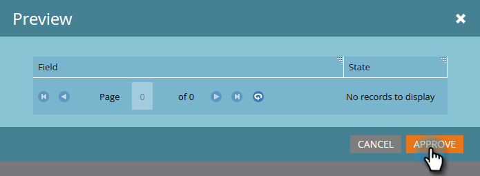

# Godkänn ett anpassat objekt {#approve-a-custom-object}

Du måste godkänna ett anpassat objekt innan du kan använda det. Processen skiljer sig något mellan nya anpassade objekt och objekt som du har redigerat.

## Godkänn ett nytt anpassat objekt {#approve-a-new-custom-object}

Du har skapat ett helt nytt anpassat objekt. Så här godkänner du det.

1. I Admin klickar du på **Markering till anpassade objekt** och markerar ett objekt som är i utkastläge.

   

1. Klicka på listrutan **Anpassade objektåtgärder** och välj **Godkänn objekt**.

   

1. Läget ändras till Godkänd.

   

   >[!NOTE]
   >
   >Ett anpassat objekt som används i en *en-till-många-struktur* måste ha minst ett dedupliceringsfält, ett länkfält, ett länkat objektnamn och ett länkat fältnamn som ska godkännas.
   >
   >
   >Ett anpassat objekt som används i en *många-till-många-struktur* behöver **inte** något länkfält, länkat objektnamn eller ett länkat fältnamn när du godkänner det (eftersom de finns i det mellanliggande objektet).
   >
   >
   >Ett anpassat objekt som används som *mellanliggande objekt* kräver ett länkfält, ett namn på ett länkat objekt och ett länkat fältnamn, men **kräver inget** dedupliceringsfält.
   >
   >
   >Mer information finns i [Förstå anpassade objekt](understanding-marketo-custom-objects.md) i Marketto.

Så ja! Nu kan du välja det anpassade objektet i begränsningarna för filter och utlösare som ska användas i dina kampanjer.

## Godkänn ett redigerat anpassat objekt {#approve-an-edited-custom-object}

När du har redigerat ett godkänt anpassat objekt måste du godkänna utkastet för att kunna återställa det anpassade objektet till läget Godkänd.

1. När du redigerar ett anpassat objekt som redan godkänts får det ett godkänt med utkastläge.

   

1. När du är klar att godkänna utkastet klickar du på listrutan **Anpassade objektåtgärder** och väljer **Godkänn objekt**.

   

1. I en förhandsgranskning visas de objekt som har ändrats i utkastet. Klicka på **Godkänn**.

   

