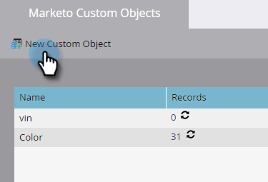

# Skapa anpassade Marketo-objekt {#create-marketo-custom-objects}

Använd anpassade objekt i Marketo för att spåra mätvärden som är specifika för ditt företag. Det kan vara allt från bilar till kurser - allt du vill göra i Marketo för att genomföra kampanjer.

>[!NOTE]
>
>Du kan ställa in anpassade objekt så att de fungerar på en-till-många- eller många-till-många-basis. Du skapar det ursprungliga objektet på samma sätt, men stegen är olika när du börjar lägga till fält till objektet. Se  [Förstå anpassade Marketo-objekt](/help/marketo/product-docs/administration/marketo-custom-objects/understanding-marketo-custom-objects.md) för mer information.

>[!NOTE]
>
>Du kan inte skapa, redigera eller ta bort ett länk- eller borttagningsfält när det anpassade objektet har godkänts.

## Skapa ett anpassat objekt för en 1:N-struktur {#create-a-custom-object-for-a-one-to-many-structure}

I det här exemplet visas ett anpassat bildobjekt som kan användas i en en-till-många-struktur. Senare skapar du ett kursanpassat objekt och ett mellanliggande objekt som du kan använda i en många-till-många-struktur.

1. Gå till **[!UICONTROL Admin]** område.

   

1. Klicka på **[!UICONTROL Marketo Custom Objects]**.

   

1. Klicka på **[!UICONTROL New Custom Object]**.

   

   >[!NOTE]
   >
   >The [!UICONTROL Marketo Custom Objects] På -fliken visas alla anpassade objekt till höger och information om godkända objekt, inklusive antal poster och fält vid den senaste uppdateringen.

1. Ange [!UICONTROL Display Name]. The [!UICONTROL API Name] och [!UICONTROL Plural Name] fylls i automatiskt. Ange [!UICONTROL Description] (valfritt).

   

   >[!NOTE]
   >
   >Du kan redigera dessa fält när du skapar dem, men när de har sparats kan du bara redigera [!UICONTROL Plural Name] fält och **[!UICONTROL Show in Lead Detail]** skjutreglage.

1. Dra **[!UICONTROL Show in Lead Detail]** skjutreglage som ska visas **[!UICONTROL Show]** om du vill visa anpassade objektdata på databassidan. Klicka på **[!UICONTROL Save]**.

   

1. Den anpassade objektinformationen visar det innehåll du har angett. Observera att det är i utkastläge.

   

   Nästa steg är att lägga till fält i [bygga ut ditt anpassade objekt](/help/marketo/product-docs/administration/marketo-custom-objects/add-marketo-custom-object-fields.md).

   >[!NOTE]
   >
   >Du kan bara fylla i anpassade Marketo-objekt via en listimport eller [API](https://developers.marketo.com/documentation/rest/).

## Skapa ett anpassat objekt för en många-till-många-struktur {#create-a-custom-object-for-a-many-to-many-structure}

I det här exemplet visas ett anpassat kursobjekt som du använder för att skapa en många-till-många-relation mellan människor/företag och kurser. När du är klar skapar du ett mellanliggande objekt som kopplar det till personer eller företag i din databas.

>[!NOTE]
>
>För många-till-många-relationer behöver du inte skapa någon länk i det anpassade objektet. I stället lägger du till två länkar till mellanliggande objekt (se nedan).

1. Gå till **[!UICONTROL Admin]** område.

   

1. Klicka på **[!UICONTROL Marketo Custom Objects]**.

   

1. Klicka på **[!UICONTROL New Custom Object]**.

   

1. Ange [!UICONTROL Display Name]. The [!UICONTROL API Name] och [!UICONTROL Plural Name] fylls i automatiskt. Ange [!UICONTROL Description] (valfritt).

   

   >[!NOTE]
   >
   >Du kan redigera dessa fält när du skapar dem, men när de har sparats kan du bara redigera [!UICONTROL Plural Name] fält och **[!UICONTROL Show in Lead Detail]** skjutreglage.

1. Dra **[!UICONTROL Show in Lead Detail]** skjutreglage som ska visas **[!UICONTROL Show]** om du vill visa anpassade objektdata på databassidan. Klicka på **[!UICONTROL Save]**.

   

1. Den anpassade objektinformationen visar det innehåll du har angett. Observera att det är i utkastläge.

   

   >[!NOTE]
   >
   >Du kan bara fylla i anpassade Marketo-objekt via en listimport eller [API](https://developers.marketo.com/documentation/rest/).

Nästa steg är att skapa ett mellanliggande objekt (se nedan). Innan dess måste du skapa ett fält som du kan länka till.

## Skapa ett mellanliggande objekt {#create-an-intermediary-object}

Använd ett mellanliggande objekt för att koppla ett anpassat objekt till personer eller företag. I det här exemplet används den för att koppla ihop kurser i ditt anpassade kursobjekt med personer eller företag i din databas.

>[!NOTE]
>
>Du behöver inte skapa ett mellanliggande objekt för en anpassad objektstruktur med en-till-många.

1. Gå till **[!UICONTROL Admin]** område.

   

1. Klicka på **[!UICONTROL Marketo Custom Objects]**.

   

1. Klicka på **[!UICONTROL New Custom Object]**.

   

1. Ange [!UICONTROL Display Name]. The [!UICONTROL API Name] och [!UICONTROL Plural Name] fylls i automatiskt. Ange [!UICONTROL Description] (valfritt).

   

   >[!NOTE]
   >
   >Du kan redigera dessa fält när du skapar dem, men när de har sparats kan du bara redigera [!UICONTROL Plural Name] fält och [!UICONTROL Show in Lead Detail] skjutreglage.

1. Dra **[!UICONTROL Show in Lead Detail]** skjutreglage som ska visas **Visa** om du vill visa anpassade objektdata på databassidan. Klicka **Spara**.

   

1. Den anpassade objektinformationen visar det innehåll du har angett. Observera att det är i utkastläge.

   Nästa steg är att du ska [lägg till länkfält](/help/marketo/product-docs/administration/marketo-custom-objects/add-marketo-custom-object-link-fields.md) för att ansluta ditt mellanliggande objekt till en person/ett företag och ett anpassat objekt.

>[!MORELIKETHIS]
>
>* [Lägg till anpassade Marketo-objektfält](/help/marketo/product-docs/administration/marketo-custom-objects/add-marketo-custom-object-fields.md)
>* [Lägg till Marketo anpassade objektlänkfält](/help/marketo/product-docs/administration/marketo-custom-objects/add-marketo-custom-object-link-fields.md)
>* [Förstå anpassade Marketo-objekt](/help/marketo/product-docs/administration/marketo-custom-objects/understanding-marketo-custom-objects.md)
