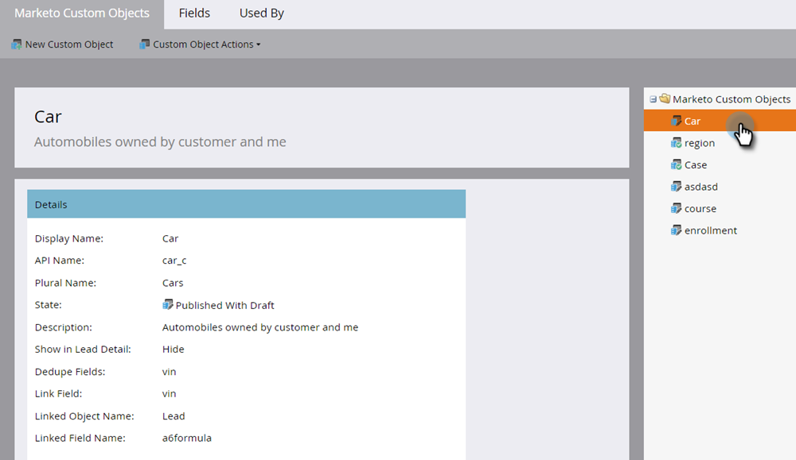

# Redigera och ta bort ett anpassat Marketo-objekt {#edit-and-delete-a-marketo-custom-object}

>[!NOTE]
>
>Du kan inte skapa, redigera eller ta bort ett länk- eller borttagningsfält när det anpassade objektet har godkänts.

## Redigera ett anpassat objekt {#edit-a-custom-object}

Använd menyn Anpassade objektåtgärder för att redigera eller ta bort ett anpassat objekt.

1. Gå till **Administratör** område.

   

1. Klicka **Anpassade Marketo-objekt**.

   

1. Markera det anpassade objekt som du vill redigera till höger.

   

1. Klicka på **Anpassade objektåtgärder** och klicka **Redigera objekt**.

   

1. Gör önskade ändringar. Dra skjutreglaget över om du vill visa objektet på sidan Leaddetaljer. Klicka **Spara**.

   

1. Var noga med att godkänna [det redigerade objektet](/help/marketo/product-docs/administration/marketo-custom-objects/approve-a-custom-object.md).

## Ta bort ett anpassat objekt {#delete-a-custom-object}

Det är enkelt att ta bort ett anpassat objekt, men du måste vara försiktig. Anpassade objekt kan anslutas till andra objekt eller till smarta listor. Marketo varnar dig innan du släpper **Ta bort**.

>[!CAUTION]
>
>Du kan inte återställa ett anpassat objekt när du har tagit bort det.

1. Gå till **Administratör** område.

   

1. Klicka **Anpassade Marketo-objekt**.

   

1. Markera det objekt som du vill ta bort.

   

1. Klicka **Anpassade objektåtgärder** och markera **Ta bort objekt**.

   

   >[!TIP]
   >
   >Du kan också högerklicka på objektet och markera **Ta bort objekt**.

1. Om det anpassade objektet är i utkastform, inte godkänt än, får du den här varningen. Om du är säker klickar du på **Ta bort**.

   

1. Om det anpassade objektet redan har godkänts finns det en större risk om du tar bort det. Så du får en bättre varning. Retur **Jag förstår**, kontrollera **Kan inte ångra** och klicka **Ta bort**.

   

   >[!NOTE]
   >
   >Om det anpassade objektet är länkat till ett mellanliggande objekt måste du först ta bort mellanliggande objekt.

>[!MORELIKETHIS]
>
>[Godkänn ett anpassat objekt](/help/marketo/product-docs/administration/marketo-custom-objects/approve-a-custom-object.md)
