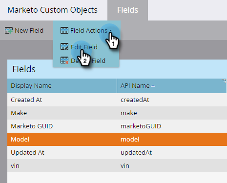

# Redigera och ta bort anpassade Marketo-objektfält {#edit-and-delete-marketo-custom-object-fields}

## Redigera ett fält {#edit-a-field}

Ibland behöver du redigera ett fält som inte har godkänts än.

1. Klicka på ett anpassat objekt och det fält som du vill redigera.

   

1. I [!UICONTROL Fields] flik, klicka **[!UICONTROL Field Actions]** och **[!UICONTROL Edit Field]**.

   

1. Gör ändringarna och klicka **[!UICONTROL Save]**.

   

   >[!NOTE]
   >
   >Du kan inte redigera API-namnet.

1. Ändringarna visas i fältlistan.

   

## Ta bort ett fält {#delete-a-field}

Om du inte behöver ett fält i ett anpassat objekt längre kan du ta bort det.

1. Klicka på fliken Fält **[!UICONTROL Field Actions]** och **[!UICONTROL Delete Field]**.

   

1. Se till att du verkligen vill ta bort fältet innan du trycker på utlösaren! Klicka på **[!UICONTROL Delete]**.

   

Den är borta!

>[!NOTE]
>
>[Lägg till anpassade Marketo-objektfält](/help/marketo/product-docs/administration/marketo-custom-objects/add-marketo-custom-object-fields.md)
