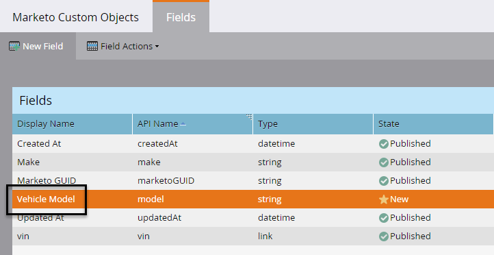
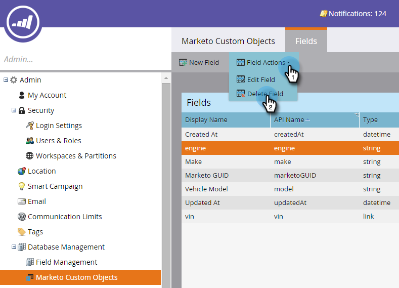

# Redigera och ta bort markering i anpassade objektfält {#edit-and-delete-marketo-custom-object-fields}

## Redigera ett fält {#edit-a-field}

Ibland behöver du redigera ett fält som inte har godkänts än.

1. Klicka på ett anpassat objekt och det fält som du vill redigera.

   

1. På fliken Fält klickar du på **Fältåtgärder** och **Redigera fält**.

   

1. Gör ändringarna och klicka på **Spara**.

   

   >[!NOTE]
   >
   >Du kan inte redigera API-namnet.

1. Ändringarna visas i fältlistan.

   

## Ta bort ett fält {#delete-a-field}

Om du inte behöver ett fält i ett anpassat objekt längre kan du ta bort det.

1. På fliken Fält klickar du på **Fältåtgärder** och **Ta bort fält**.

   

   Se till att du verkligen vill ta bort fältet innan du trycker på utlösaren! Klicka på **Ta bort**.

   

1. Den är borta!

   

   >[!NOTE]
   >
   >**Relaterade artiklar**
   >
   >
   >[Lägg till markering i anpassade objektfält](add-marketo-custom-object-fields.md)

