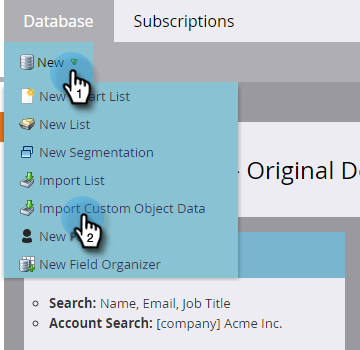

# Importera anpassade objektdata {#import-custom-object-data}

Det är enkelt att importera anpassade objektdata till databasen. Om du använder anpassade objekt med företag finns mer information i [Använda anpassade objekt med företag](/help/marketo/product-docs/administration/marketo-custom-objects/understanding-marketo-custom-objects.md#using-custom-objects-with-companies) för mer information.

1. I My Marketo går du till **[!UICONTROL Database]**.

   

1. Klicka på **[!UICONTROL New]** och välj **[!UICONTROL Import Custom Object Data]**.

   

1. Klicka **[!UICONTROL Browse]** för att hitta datafilen. Markera filformatet (kommaseparerade värden i det här exemplet).

   

1. Välj [!UICONTROL custom object].

   

1. Välj [!UICONTROL Dedupe Mode] i listrutan. Klicka på **[!UICONTROL Next]**.

   

   >[!NOTE]
   >
   >Använd Dedupe-fält som unika identifierare när du skapar eller uppdaterar anpassade objektposter. I det här exemplet används fältet för borttagning av dubbletter i **bil** anpassat objekt - vin (fordons-ID-nummer). Om du bara uppdaterar anpassade objektposter kan du välja [!UICONTROL Marketo Guid] som [!UICONTROL Dedupe Mode].

1. Mappa varje kolumn till ett Marketo-fält och välj den i listrutan.

   

   >[!NOTE]
   >
   >Kontrollera att värdena i filen matchar den typ av fält som du matchar dem till (t.ex. text, heltal osv.), annars kommer filen att refuseras.

1. Klicka på **[!UICONTROL Next]**.

   

1. Klicka på **[!UICONTROL Import]**.

   

   >[!NOTE]
   >
   >Storleksgränsen för anpassade objekt är 100 MB.

   >[!TIP]
   >
   >Ange din e-postadress i dialogrutan **[!UICONTROL Send Alert To]** och Marketo skickar ett e-postmeddelande till dig när importen är klar!

1. I skärmens övre högra hörn visas ett meddelande när importen körs och det slutliga resultatet när den är klar.

   

   Ja!

>[!MORELIKETHIS]
>
>[Förstå anpassade Marketo-objekt](/help/marketo/product-docs/administration/marketo-custom-objects/understanding-marketo-custom-objects.md)
