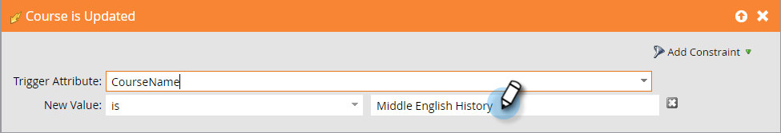

# Utlös ändringar av anpassade objekt {#trigger-off-custom-object-changes}

>[!NOTE]
>
>Den här funktionen är endast tillgänglig:
>
>* För kunder med Orion-infrastrukturen
>* Kan endast användas med anpassade Marketo-objekt, inte anpassade objekt som synkroniseras via den inbyggda Salesforce- eller Microsoft Dynamics-integreringen
>* Som utlösare, inte ett filter
>
>Kontakta [Marketo Support](https://nation.marketo.com/t5/Support/ct-p/Support) om du vill att utlösare för anpassade objektändringar ska vara aktiverade.

I den smarta kampanjens lista kan du utlösa en flödesåtgärd när ett anpassat objekt läggs till en person eller ett företag. Du kan också skapa en smart lista som använder en *change* i ett anpassat objekt som utlösare. Du kan till exempel använda den för att skicka ett e-postmeddelande när ett kursnamn uppdateras.

>[!NOTE]
>
>Ingen aktivitetsloggpost skapas när en anpassad objektpost ändras.

1. I Marketo går du till **Marknadsföringsaktiviteter.**

   

1. Skapa eller öppna en befintlig smart kampanj och välj Smart lista.

   

1. Sök efter den utlösare du behöver och dra den till arbetsytan.

   

1. Markera utlösarattributet.

   

1. Du kan också ange en begränsning.

   

1. Och där är du. Ändringen sparas automatiskt.

   

   >[!NOTE]
   >
   >* [Skapa en smart lista](/help/marketo/product-docs/core-marketo-concepts/smart-lists-and-static-lists/creating-a-smart-list/create-a-smart-list.md)
   >* [Förstå anpassade Marketo-objekt](/help/marketo/product-docs/administration/marketo-custom-objects/understanding-marketo-custom-objects.md)

