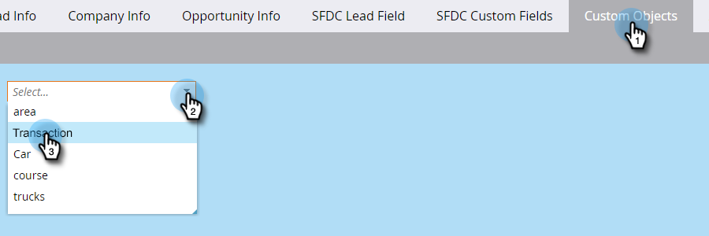

# Förstå anpassade Marketo-objekt {#understanding-marketo-custom-objects}

Använd anpassade objekt för att spåra mätvärden som är specifika för din verksamhet.

>[!AVAILABILITY]
>
>Alla kunder har inte köpt den här funktionen. Kontakta din säljare för mer information.

Använd anpassade objekt som filter och triggers i era smarta kampanjer. Exempel:

* **Filter**: Skicka e-postmeddelanden endast till ägare av ett visst fordonsmärke
* **Utlösare**: Skicka ett e-postmeddelande när ett anpassat objekt läggs till en person eller ett företag.

Du kan ställa in anpassade objekt i en 1:N- eller många-till-många-relation. Exempel:

* **En-till-många**: En person äger flera bilar
* **Många-till-många**: Flera studenter är inskrivna i flera kurser från en kurskatalog

I en en-till-många-struktur används ett enda länkfält för att koppla det anpassade objektet till en person eller ett företag.

Många-till-många anpassade objekt använder två länkfält, som ingår i ett mellanliggande objekt. Ett länkfält är anslutet till personen eller företaget och ett annat är anslutet till det anpassade objektet, t.ex. kurskatalogen. Detta mellanliggande objekt kan innehålla ytterligare anpassade fält, t.ex. en kursklass eller ett närvarodatum, som ytterligare definierar anslutningstypen.

>[!TIP]
>
>Importera egna objekt med kommaavgränsade värden (CSV) i användargränssnittet för att testa och validera ett dataexempel. Ladda sedan upp alla filer med ett API.

>[!CAUTION]
>
>Du kan inte återställa anpassade objekt, så kontrollera att du inte behöver dem längre innan du tar bort dem.

## Åtkomst till anpassade Marketo-objekt {#accessing-marketo-custom-objects}

1. Gå till **[!UICONTROL Admin]** område.

   

1. Klicka på **[!UICONTROL Marketo Custom Objects]**.

   

1. I Marketo anpassade objekt visas alla dina anpassade objekt till höger, men bara de godkända objekten i huvudstödrastret.

   

   >[!NOTE]
   >
   >I rutnätet visas objektnamn, antal poster, antal fält och datum för den senaste uppdateringen.

   >[!TIP]
   >
   >Marketo uppdaterar dessa fält automatiskt, men du kan uppdatera visningen genom att klicka på ikonen i kolumnen Poster.

1. Klicka på objektnamnet till höger för att öppna informationssidan.

   

## Visa anpassade objekt som är kopplade till en person {#view-custom-objects-associated-to-a-person}

När du har skapat den anpassade objektstrukturen kopplas de anpassade objekten automatiskt till personer i databasen med hjälp av länkfältet i det anpassade objektet när du överför specifika anpassade objektdata. Du kan visa information från [!UICONTROL Custom Objects] på sidan med personinformation.

1. Gå till **[!UICONTROL Database]**.

   

1. Öppna databasen och klicka på **[!UICONTROL People]** -fliken. Dubbelklicka på posten för en person som är kopplad till ett anpassat objekt.

   

1. På personinformationssidan klickar du på **[!UICONTROL Custom Objects]** -fliken. Markera objektet i listrutan.

   

1. Nu kan du visa en lista över alla anpassade objekt av den typen som är kopplade till den personen.

   

## Använda anpassade objekt med företag {#using-custom-objects-with-companies}

Ett anpassat objekt som är länkat till företaget fungerar bäst om du synkroniserar företag från CRM eller om du uttryckligen skapar företag med API:t. Vi rekommenderar även att du använder företags-ID som länkfält.

Om du har flera personer i Marketo som är poster i CRM- eller Marketo-poster kopplas inte ett anpassat objekt som är länkat till ett företag till mer än en enskild post. Detta beror på att ett företag som har flera personer under det bara stöds när företag synkroniseras från CRM eller om du använder ett API för att skapa företag.

Anpassade objekt kan bara länka direkt till en enskild post. Det innebär att när din anpassade objekttyp är länkad efter företagsfält bör du se till att dina personposter är kopplade till ett företag antingen med hjälp av kontaktkonvertering i CRM eller med hjälp av fältet externalCompanyId om du hanterar företag som använder Marketo REST API:er. För personposter som inte är uttryckligen länkade till företagsposter, kommer anpassade objekt som är länkade med hjälp av företag att slumpmässigt länkas till en enda post, även om värdet i företagsfältet delas av många personer.

Se [Importera anpassade objektdata](/help/marketo/product-docs/administration/marketo-custom-objects/import-custom-object-data.md) för mer information.

>[!MORELIKETHIS]
>
>* [Skapa anpassade Marketo-objekt](/help/marketo/product-docs/administration/marketo-custom-objects/create-marketo-custom-objects.md)
>* [Godkänn ett anpassat objekt](/help/marketo/product-docs/administration/marketo-custom-objects/approve-a-custom-object.md)
>* [Redigera och ta bort ett anpassat Marketo-objekt](/help/marketo/product-docs/administration/marketo-custom-objects/edit-and-delete-a-marketo-custom-object.md)
>* [Lägg till anpassade Marketo-objektfält](/help/marketo/product-docs/administration/marketo-custom-objects/add-marketo-custom-object-fields.md)
>* [Redigera och ta bort anpassade Marketo-objektfält](/help/marketo/product-docs/administration/marketo-custom-objects/edit-and-delete-marketo-custom-object-fields.md)
>* [Importera anpassade objektdata](/help/marketo/product-docs/administration/marketo-custom-objects/import-custom-object-data.md)

