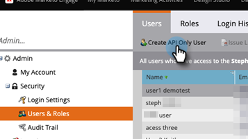

# Lägg till endast API-användare för Adobe IMS-aktiverade prenumerationer {#add-api-only-user-for-adobe-ims-enabled-subscriptions}

Marketo Engage Marketing Users and Administrators is managed in Adobe Admin Console, Marketo Engage API Only Users must be created and managed in Marketo Engage.

Stegen nedan beskriver hur du lägger till en användare med endast API i Marketo Engage. Innan du gör det måste du ha [har etablerat en roll för enbart API](/help/marketo/product-docs/administration/users-and-roles/create-an-api-only-user-role.md).

1. I Marketo klickar du på **[!UICONTROL Admin]** och markera **[!UICONTROL Users & Roles]**.

   

1. Klicka på **[!UICONTROL Create API Only User]**.

   

1. Ange en [!UICONTROL Email], [!UICONTROL First Name]och [!UICONTROL Last Name] för användare med endast API. Välj [!UICONTROL API Only] Roll som du vill tilldela användaren. Klicka **[!UICONTROL Create API Only User]** när det är klart.

   

>[!NOTE]
>
>När åtgärden lyckas stängs spärrlistan Skapa endast API-användare och användarlistan uppdateras och den nya användaren visas.
