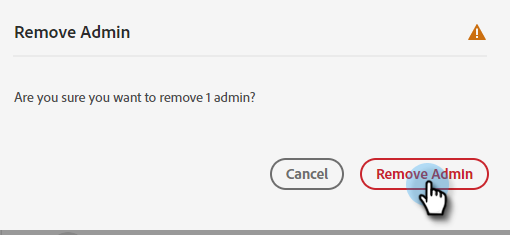

# Lägg till eller ta bort en produktadministratör {#add-or-remove-a-product-admin}

>[!NOTE]
>
>**System** Administratörer skapas endast på organisationsnivå i Adobe. Om du tror att du behöver mer än ett, vänligen kontakta [Marketo Support](https://nation.marketo.com/t5/support/ct-p/Support).

## Lägg till en produktadministratör {#add-a-product-admin}

>[!IMPORTANT]
>
>En administratör måste läggas till i en produktprofil för att få tillgång till Marketo Engage.

1. Logga in på [Adobe Admin Console](https://adminconsole.adobe.com/).

   

1. Klicka **Marketo Engage**.

   

1. Välj önskad prenumeration (om du har fler än en).

   

1. Klicka på **Administratörer** -fliken.

   

1. Klicka på **Lägg till administratör** -knappen.

   

1. Ange e-postadressen eller användarnamnet för den administratör du vill lägga till. Förnamn och efternamn är valfria. Klicka **Spara**.

   

1. Klicka på namnet på den administratör som du nyss lade till.

   

1. Klicka på menyn tre punkter under Produkter och välj **Redigera**.

   

1. Klicka på **+** signera. Klicka på nedtryckningen bredvid den önskade Marketo Engage-prenumerationen (om det finns fler än en) och välj önskad produktprofil.

   

1. Klicka **Spara**.

   

Användaren får sedan två e-postmeddelanden. Det första e-postmeddelandet meddelar dem att de har tilldelats produktadministratörsrättigheter till Marketo Engage. Det andra e-postmeddelandet bjuder in dem att logga in på Marketo Engage.

>[!NOTE]
>
>När produktadministratörsanvändaren läggs till i Marketo Engage via Adobe Admin Console får användaren rollen produktadministratör för Adobe i prenumerationen.

## Ta bort en administratör {#remove-a-user}

1. Logga in på [Adobe Admin Console](https://adminconsole.adobe.com/).

   

1. Klicka **Marketo Engage**.

   

1. Välj önskad prenumeration (om du har fler än en).

   

1. Klicka på **Administratörer** -fliken.

   

1. Välj den administratör som du vill ta bort och klicka på **Ta bort administratör** -knappen.

   

1. Klicka **Ta bort administratör** för att bekräfta.

   

Användaren får sedan ett e-postmeddelande som meddelar att de inte längre har produktadministratörsåtkomst till Marketo Engage.
