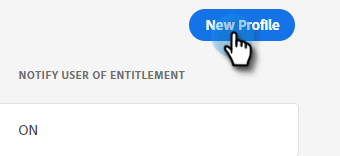

# Administratörsinställningar {#admin-setup}

När du har lagts till som systemadministratör för Marketo i en Adobe-organisation behöver du utföra den första konfigurationen i några steg.

## Installation av systemadministratör {#system-admin-setup}

1. När din Adobe-organisation har etablerats får den utsedda systemadministratören ett välkomstmeddelande via e-post. Klicka på **Kom igång** i det e-postmeddelandet.

   

1. Om du tidigare har använt ett program med en Adobe ID kommer du direkt till Adobe Admin Console. Om inte, [konfigurera din Adobe ID](https://helpx.adobe.com/manage-account/using/create-update-adobe-id.html).

   

## Skapa en produktprofil {#create-a-product-profile}

När systemadministratören har öppnat Admin Console är det dags att skapa en produktprofil.

1. Klicka på **Marketo Engage** under Produkter och tjänster.

   

1. Välj önskad prenumeration. Om du bara har ett, hoppa till nästa steg.

   

   >[!NOTE]
   >
   >Om du har flera prenumerationer måste du följa dessa steg för var och en av dem.

1. Klicka på knappen **Ny profil**.

   

1. Ge produktprofilen ett namn (visningsnamn och beskrivning är valfria) och klicka på **Spara**.

   

>[!NOTE]
>
>Om du konfigurerar flera produktprofiler får användarna samma tillgång till Marketo, oavsett vilken profil de läggs till i.

## Produktadministratörsinställningar {#product-admin-setup}

1. När du har bjudits in av en systemadministratör får du ett välkomstmeddelande. Klicka på **Kom igång** i det e-postmeddelandet.

   

1. Om du tidigare har använt ett program med en Adobe ID kommer du direkt till Adobe Admin Console. Om inte, [konfigurera din Adobe ID](https://helpx.adobe.com/manage-account/using/create-update-adobe-id.html).

   

Så enkelt är det! Produktadministratörer ansvarar i första hand för att lägga till användare. [Lär dig hur du gör det här](/help/marketo/product-docs/administration/marketo-with-adobe-identity/add-or-remove-a-user.md#add-a-user).

>[!MORELIKETHIS]
>
>[Lägg till eller ta bort en produktadministratör](/help/marketo/product-docs/administration/marketo-with-adobe-identity/add-or-remove-a-product-admin.md)
