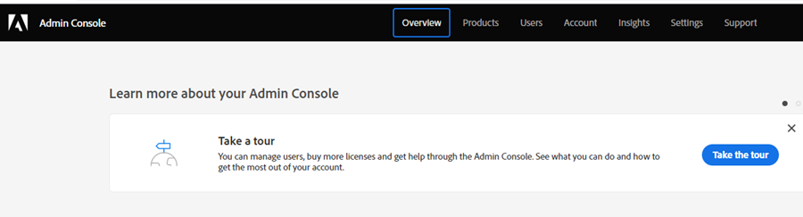

# Produktadministratörsinställningar {#product-admin-setup}

1. När du har bjudits in av en systemadministratör får du ett välkomstmeddelande. Klicka på **Kom igång**.

   

1. Om du tidigare har använt ett program med en Adobe ID kommer du direkt till Adobe Admin Console. Om inte, [konfigurera din Adobe ID](https://helpx.adobe.com/manage-account/using/create-update-adobe-id.html).

   

Så enkelt är det! Produktadministratörer ansvarar i första hand för att lägga till användare. [Lär dig göra det här](/help/marketo/product-docs/administration/marketo-with-adobe-identity/add-or-remove-a-user.md#add-a-user).
