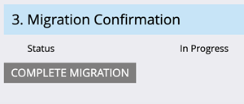
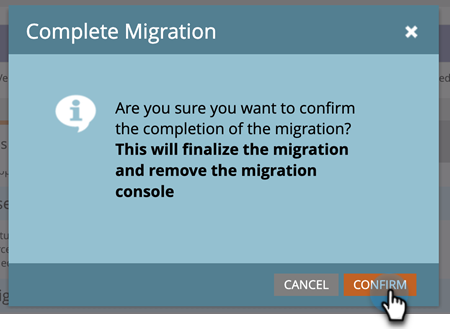

# Migrerar till Adobe-identitet {#migrating-to-adobe-identity}

När Adobe schemalägger en prenumerations användarmigrering får produktadministratörer i Marketo Engage tillgång till migreringskonsolen, som finns på navigeringsmenyn i administratörsområdet under Integrering.

## Före migrering {#pre-migration}

Innan migreringen börjar kan en administratör ändra startdatumet för användarmigreringen för sin prenumeration genom att gå till skärmen Före migrering på migreringskonsolen. Om du vill ändra datumet kan administratören klicka på **Redigera** -knappen.

Administratören kan välja ett datum mellan 8 och 30 dagar i framtiden. När ett datum har valts måste administratören klicka **Spara** för att göra ändringen.

>[!NOTE]
>
>Om du vill begära ett datum före 8 dagar eller efter 30 dagar, eller om du behöver justera datumet efter att konsolen före migrering är låst, skickar du ett e-postmeddelande till `marketocares@marketo.com`.

## Migrering till Adobe-identitet {#migrations-to-adobe-identity}

Alla Marketo-prenumerationer med en tidszon i USA migreras från och med midnatt, Pacific Standard Time, efter startdatumet för användarmigreringen. Migreringen av användare för alla andra prenumerationer börjar vid midnatt i prenumerationens angivna tidszon. När en prenumerations användarmigrering börjar är användarhantering inte längre tillgänglig i Marketo Admin, utan bara i Adobe Admin Console. Rollhantering finns kvar på fliken Användare och roller i Marketo Admin-området samt lokal (endast API) användarhantering.

Adobe migrerar automatiskt alla Marketo-administratörer med verifierade e-postmeddelanden först. När Marketo-administratörer migreras till Adobe Identity läggs de till i prenumerationens Adobe Admin Console som produktadministratör för Marketo-prenumerationen och tilldelas Adobe produktadministratörsrollen i Marketo-programmet (tillsammans med andra roller de tidigare haft) och har sedan rätt till prenumerationen på Adobe ID. Administratörerna får två e-postmeddelanden. Den ena anger att de har utsetts till produktadministratör för Adobe och den andra anger att de har rätt till Marketo-produkten.

**Marketo Product Administrator Email**

**Marketo berättigandee-post**

**Om din Marketo-prenumeration har färre än 75 användare** migrerar Adobe automatiskt resten av dina användare. Det här arbetsflödet ger den högsta nivån av automatisering och ingen åtgärd krävs för att utföra migreringen. När migreringen är klar visas inte Marketo migreringskonsol längre i navigeringsområdet i Marketo Admin och alla användare kommer att få åtkomst till Marketo via en Adobe ID.

**Om din Marketo-prenumeration har 75 eller fler användare**, får Marketo produktadministratörer tillgång till migreringsverktyget för självbetjäningsanvändare i migreringskonsolen när användarmigreringen startar och varnas via banner vid inloggning på Min Marketo-sida. Administratören ansvarar för att slutföra användarmigreringen med verktyget för självbetjäningsanvändarmigrering.

## Marketo Self-Service User Migration {#marketo-self-service-user-migration}

Verktyget Marketo Self-Service User Migration Console består av två flikar.

* **Fliken Migreringsstatus**
* **Fliken Användarmigrering**

### Fliken Migreringsstatus {#migration-status-tab}

Fliken Migreringsstatus innehåller övergripande mätvärden för förloppet för användarens e-postverifiering, användarens migrering och aktivering samt slutförande av prenumerationsmigreringen.

Överst i migreringsstatusen visas prenumerationsmigreringens förfallodatum och knappen för att förlänga förfallotiden. Mer information om när migreringen upphör finns i [Avsnittet Förfallotid för användarmigrering](#user-migration-expiration).

I nästa avsnitt på fliken Migreringsstatus finns två förloppsindikatorer. Den första förloppsindikatorn är att visa förloppet när användarens e-postverifiering är klar. Den andra förloppsindikatorn visar förloppet för slutförd användarmigrering.

Därefter visas tre avsnitt av statusen för administratören.

* **Verifiering av användarens e-postadress**: verifieringsstatus för användare i prenumerationen.
* **Migrering och aktivering av användare**: användarmigrering och aktivering (migrering och tillstånd till Marketo Engage-produkten) för de användare som ingår i prenumerationen.
* **Bekräftelse av migrering**: prenumerationens slutförandestatus för migrering.

#### Verifiering av användarens e-postadress {#user-email-verification}

I avsnittet Verifiering av användarens e-post kan en administratör hitta den aktuella statusen för e-postverifiering för användarna i prenumerationen, innan migrering till Adobe-identitet sker.

En administratör kan visa prenumerationens e-postverifieringsstatus, hur många användare i prenumerationen som har slutfört e-postverifieringen och hur många användare som har markerats som ignorerade. Status rapporteras för alla användares e-postverifieringstillstånd i prenumerationen. Administratören kan klicka på antalet användare som hoppats över och navigeras till fliken Användarmigrering för att visa de användare som hoppats över.

Bekräftelsemeddelandet kan skickas igen av en administratör på fliken Användarmigrering på migreringskonsolen och på fliken Användare och roller i området Marketo Admin, eller av användaren i deras kontoinställningar. Länken i bekräftelsemeddelandet upphör, precis som med e-postmeddelanden från användare, om 3 dagar. Mer information om e-postverifiering finns på [Community](https://nation.marketo.com/) och i [dokumentation om e-postverifiering](/help/marketo/product-docs/administration/users-and-roles/email-verification.md).

>[!IMPORTANT]
>
>Om en Marketo Engage-användare inte kan verifiera sin e-postadress kan de inte migreras till en Adobe ID och förlorar åtkomsten till Marketo-prenumerationen när migreringen är klar. För att återfå åtkomst måste en Marketo-produktadministratör lägga till dem som en ny användare.

#### Migrering och aktivering av användare {#user-migration-and-activation}

I avsnittet Användarmigrering och aktivering hittar en administratör den aktuella statusen för total användarmigrering och behörighet till Adobe Identity Management System.

En administratör kan visa procentandelen användare i prenumerationen som har migrerats till en Adobe ID eller markerats som Överhoppad. Status rapporteras för alla användares migreringstillstånd till en Adobe ID i prenumerationen, eller markeras som Överhoppad och kommer inte att migreras. När användare migreras och har rätt till Marketo Engage, eller hoppas över, uppdateras den här statusen.

#### Bekräftelse av migrering {#migration-confirmation}

I avsnittet Bekräftelse av migrering måste en administratör bekräfta att användarmigreringen har slutförts för prenumerationen.

När alla användare i prenumerationen har tagits med (antingen migrerats eller hoppats över) visas knappen för att slutföra migreringen.

Administratören som utför migreringen måste bekräfta migreringen genom att klicka på **Slutför migrering** -knappen. De uppmanas att **Bekräfta**.

När användarmigreringen är klar tas migreringskonsolen bort från navigeringsmenyn i Admin.

### Förfallotid för användarmigrering {#user-migration-expiration}

Adobe kräver att man slutför självbetjäningsmigreringar inom 30 dagar. Administratörer kommer inte att blockeras från att migrera användare eller slutföra migreringen om utgångsdatumet har passerat, men de kommer bara att kunna migrera användare på begäran. Om en administratör behöver mer tid kan de förlänga prenumerationens förfallodatum.

Klicka på knappen **Utöka förfallodatum** uppdateras datumet till en vecka senare. En administratör kan förlänga giltigheten upp till tre gånger.

Adobe kommer att nå ut om du inte slutfört migreringen före förfallodatumet.

### Fliken Användarmigrering {#user-migration-tab}

På fliken Användarmigrering kan administratörer ha fullständig kontroll över användarmigreringen.

Administratörer kan välja att:

* Utlös verifieringsmeddelanden för overifierade användare via knappen Verifiera e-post
* Hoppa över användarmigrering för användare som administratören vet kan/inte kan verifiera sin e-postadress eller ska inte migreras via knappen Hoppa över migrering
* Migrera valda användare vid behov via knappen Migrera nu
* Schemalägg användarmigrering för valda användare för ett specifikt datum med knappen Schemalägg migrering
* Migrera alla berättigade användare på begäran (inget användarval behövs) via knappen Migrera alla användare

**Verifiera e-post**

E-postverifiering krävs för att en användare ska kunna migreras till en Adobe ID. Om det finns användare som inte har verifierat sin e-postadress och behöver migreras, kan administratören utlösa bekräftelsemeddelandet som skickas till användaren igen. Om du väljer en overifierad användare blir knappen Bekräfta e-post klickbar.

När administratören klickar på **Verifiera e-post** så får de ett meddelande om att e-postmeddelandet skickades.

**Hoppa över och ångra användarmigrering**

Under användarmigreringen måste alla användare antingen migreras eller hoppas över. Adobe kräver att administratörer bekräftar att en användare inte migreras och att en administratör måste markera användaren som överhoppad. Om administratören inte gör det kan de inte bekräfta att användarmigreringen har slutförts. Alla användare som hoppats över kommer inte längre att ha tillgång till Marketo när migreringen är klar.

>[!IMPORTANT]
>
>En administratör måste hoppa över alla användare med overifierade e-postmeddelanden. Om det finns användare som har verifierat sina e-postmeddelanden, men administratören inte vill migrera dem av någon anledning, bör de markeras som ignorerade.

Om du vill hoppa över en användare kan administratören välja önskad användare. Knappen Hoppa över migrering blir klickbar. Klicka på knappen **Hoppa över migrering** uppdateras sidan och den valda användarens verifieringsstatus och migreringsstatus uppdateras till Överhoppad.

En administratör kan ångra hoppet över en användare som hoppats över, om det är fastställt att användaren måste migreras.

Administratören kan välja önskad användare om användaren ska ångras. Knappen för att ångra migrering kan klickas. Klicka på knappen **Ångra migrering** kommer sidan att uppdateras.  Den valda användarens verifieringsstatus uppdateras till den aktuella statusen, antingen Verifierad eller Overifierad, och användarens migreringsstatus uppdateras till Inte startad.

>[!NOTE]
>
>Knappen Ångra migrering är bara aktiv om alla valda användare har migreringsstatusen Överhoppad.

### Migrera Marketo-användare till Adobe-ID:n {#migrating-marketo-users-to-adobe-ids}

För dem som vill ha större kontroll under användarmigreringen stöder Marketo självbetjäning för prenumerationer med 75 eller fler användare. Marketo produktadministratörer kan välja vilka användare som ska migreras gruppvis, eller alla berättigade användare samtidigt. När användarna har valts kan administratörerna välja att migrera nu eller Schemalägg migrering för ett senare datum, vilket ger administratörerna flexibilitet och kontroll över vilka användare som migreras och när. Administratörer kan också välja att migrera alla användare i en prenumeration.

En administratör kan till exempel välja en grupp med&quot;avancerade användare&quot; som de vill migrera först. När dessa användarmigreringar har slutförts kan de välja olika användargrupper baserat på variabler som arbetsyta/företag eller funktion/roll för att batchmigrera användare ytterligare. Eller så kan de bestämma sig för att migrera resten av användarna i prenumerationerna efter att den första gruppen har slutförts. Målet är att ge största flexibilitet när det gäller att distribuera Adobe ID till användare.

Alla användarmigreringar sker samtidigt och bör slutföras inom sextio sekunder. När en användarmigrering sker för en viss användare kan användaren förlora åtkomsten i upp till en minut, och det är bara om användaren är inloggad i programmet. När användarmigreringen är klar får användaren ett e-postmeddelande om hur man loggar in i Marketo Engage med en Adobe-identitet. Användaren måste acceptera inbjudan via knapplänken i e-postmeddelandet. När användaren har accepterat inbjudan bör han/hon logga in med en Adobe ID. Instruktioner om hur du loggar in i Marketo Engage med en Adobe ID [finns här](/help/marketo/product-docs/administration/marketo-with-adobe-identity/user-sign-in-with-adobe-id.md).

Användarmigreringar behandlas oberoende av varandra, så om en användarmigrering misslyckas kommer Adobe att fortsätta att bearbeta andra användarmigreringar. Om ett migreringsfel inträffar krävs ingen åtgärd av en administratör. Administratören kommer att få ett e-postmeddelande om felet och få ett meddelande om att Adobe arbetar med att lösa problemet omedelbart. Om en användares migrering misslyckas och den användaren är inloggad i Marketo Engage, kan användaren förlora åtkomsten i upp till två minuter medan det görs nya migreringsförsök. Om en användares migrering misslyckas kan användaren fortsätta få åtkomst till Marketo-identiteten i Marketo Engage tills han/hon får ett e-postmeddelande om att migreringen lyckades och han/hon uppmanas att logga in med en Adobe ID.

**Migrera nu**

En administratör kan välja en eller flera användare att migrera på begäran. Detta kommer att utlösa migreringen av användarna omedelbart. Om du vill migrera en eller flera användare kan administratören välja önskade användare och knappen Migrera nu kan klickas.

>[!NOTE]
>
>Knappen Migrera nu är bara aktiv om alla valda användare har Verified-status.

Klicka på knappen **Migrera nu** uppmanas administratören att bekräfta migreringen av de valda användarna. När administratören har bekräftat börjar användarmigreringen bearbetas så snart som möjligt.

**Schemalägg migrering**

En administratör kan välja en eller flera användare att schemalägga migrering vid ett senare datum. Om du vill schemalägga migrering för en eller flera användare väljer administratören önskade användare och knappen Schemalägg migrering blir klickbar.

>[!NOTE]
>
>Knappen Schemalägg migrering är bara aktiv om alla valda användare har verifieringsstatusen &quot;Verified&quot;.

Klicka på knappen **Schemalägg migrering** uppmanas administratören att välja önskat migreringsdatum för de valda användarna. Administratören kan bara välja datum före prenumerationens förfallodatum för migrering. När administratören bekräftar det schemaläggs användarmigreringen(en) att börja bearbetas det valda datumet.

>[!NOTE]
>
>Alla Marketo-prenumerationer med en tidszon i USA migreras från och med midnatt, Pacific Standard Time, från migreringens startdatum. Migreringen av användare för alla andra prenumerationer börjar vid midnatt i prenumerationens angivna tidszon.

**Migrera alla användare**

En administratör kan när som helst välja att migrera alla berättigade användare i en prenumeration. Detta kommer att utlösa migreringen av de berättigade användarna omedelbart. Berättigade användare är användare med verifierade e-postmeddelanden som ännu inte har migrerats.

Klicka på knappen **Migrera alla användare** uppmanas administratören att **Bekräfta** migrering av alla berättigade användare. När administratören bekräftar det kommer användarmigreringen att börja bearbeta så snart som möjligt.

