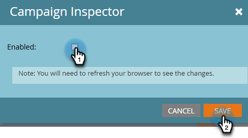

# Campaign Inspector {#campaign-inspector}

Använd Campaign Inspector för att visa/söka efter alla smarta kampanjer på ett och samma ställe.

## Aktivera Campaign Inspector {#enable-campaign-inspector}

1. Gå till området **[!UICONTROL Admin]**.

   

1. Klicka på **[!UICONTROL Treasure Chest]**.

   

1. Klicka på **[!UICONTROL Edit]** bredvid Campaign Inspector.

   

1. Markera kryssrutan **[!UICONTROL Enabled]** och klicka på **[!UICONTROL Save]**.

   

   >[!NOTE]
   >
   >Den önskade arbetsytan måste markeras i trädet för att fliken Campaign Inspector ska kunna visas när den har aktiverats.

## Använda Campaign Inspector {#using-campaign-inspector}

När du har aktiverat fliken Campaign Inspector finns den bredvid fliken Marketing Activity (Marknadsföringsaktiviteter).

Klicka på listrutan **[!UICONTROL Active Campaigns]** om du vill filtrera efter olika typer av kampanjer.

Längst ned på sidan kan du komma åt användbara verktyg som sökfältet eller exportera resultatet.

