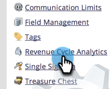

# Ändra attributinställningar för analys {#change-attribution-settings-for-analytics}

Ni kan ändra det sätt på vilket Marketo knyter kontakter till möjligheter till första- och flerberöringsattribuering, konverteringsstatistik för leads och flaggan för marknadspåverkade affärsmöjligheter.

De här inställningarna påverkar [!UICONTROL Revenue Explorer] rapporter enligt [Analys av affärsmöjligheter](/help/marketo/product-docs/reporting/revenue-cycle-analytics/program-analytics/understanding-the-program-opportunity-analysis-area.md), [Affärsmöjlighetsanalys](/help/marketo/product-docs/reporting/revenue-cycle-analytics/revenue-explorer/understanding-opportunity-analysis-in-revenue-explorer.md)och områden för Lead Analysis. Detta påverkar även [!UICONTROL Program Analyzer] rapport.

1. Gå till **[!UICONTROL Admin]** område.

   

1. Klicka på **[!UICONTROL Revenue Cycle Analytics]**.

   

1. Klicka på **[!UICONTROL Edit]** länk under **[!UICONTROL Attribution]**.

   

   >[!TIP]
   >
   >Om du ändrar den här inställningen ändras inga Marketo-data. helt enkelt förändrar hur era rapporter fungerar. Detta kan återställas när som helst.

1. Välj ett alternativ och klicka på **[!UICONTROL Save]**.

   

   >[!NOTE]
   >
   >**Definition**
   >
   >**[!UICONTROL Explicit]**: Endast kontakter med roller (standard).
   >
   >**[!UICONTROL Hybrid]**: Kontakter med roller, om sådana finns. Om det inte finns några tillgängliga används alla kontakter i kontona.
   >
   >**[!UICONTROL Implicit]**: Alla kontakter oavsett roll.

>[!CAUTION]
>
>När du använder **[!UICONTROL Implicit]** kommer Marketo alltid att undersöka alla kontakter som är kopplade till kontot, oavsett roll. **Marketo rekommenderar starkt att du använder [!UICONTROL Explicit] läge**. Använda [!UICONTROL Implicit] kan skapa falskt positiva resultat, dvs. människor som har beröm för en möjlighet trots att de inte har något verkligt inflytande på möjligheten. Använd [!UICONTROL Implicit] med försiktighet.
