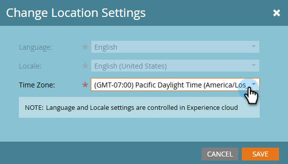

# Ändra din tidszon {#change-time-zone}

Lär dig hur du ändrar tidszonen i din Marketo Engage-prenumeration.

1. Gå till området **[!UICONTROL Admin]**.

   

1. Välj **[!UICONTROL My Account]**.

   

1. Klicka på fliken **[!UICONTROL Edit Location Settings]**.

   

1. En modal visas. Klicka på listrutan **[!UICONTROL Time zone]** och gör ditt val.

   

   >[!NOTE]
   >
   >_Språk_ och _språkinställning_ är nedtonade eftersom de inställningarna måste nås i din [Adobe-kontoprofil](https://account.adobe.com/profile){target="_blank"}.

1. Klicka på **[!UICONTROL Save]**.
