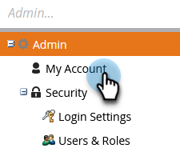

# Ändra ditt Marketo-lösenord {#change-your-marketo-password}

Ändra ditt Marketo-lösenord med dessa enkla steg.

1. Gå till **Administratör** område.

   

1. Klicka **Mitt konto**.

   

1. Klicka **Ändra lösenord**.

   

1. Ange det gamla lösenordet och det nya lösenordet och klicka sedan på **Spara**.

   

   >[!NOTE]
   >
   >Notera lösenordskraven när du gör uppdateringen.
