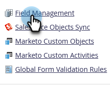

# Skapa en anpassad flik för personinformationssidan {#creating-a-custom-tab-for-the-person-detail-page}

Om du råkar leta efter en viss uppsättning fält i persondetaljen om och om igen kan du skapa en anpassad layout som gör det enklare.

1. Gå till **[!UICONTROL Admin]** område.

   

1. Klicka på **[!UICONTROL Field Management]**.

   

1. Klicka på **[!UICONTROL Custom Layout Designer]** -fliken.

   

1. Hitta ett fält som du vill lägga till och dra det till arbetsytan.

   

1. Fortsätt lägga till fält tills du har layouten som du vill ha den.

   

   >[!NOTE]
   >
   >Du har två kolumner att arbeta med.

   Om du vill ta bort ett fält högerklickar du på det och klickar på **[!UICONTROL Delete]**.

   

   Fantastiskt arbete! När du nu läser in en persons information kan du använda din anpassade layout för att komma åt den information som är viktig för dig.

   
