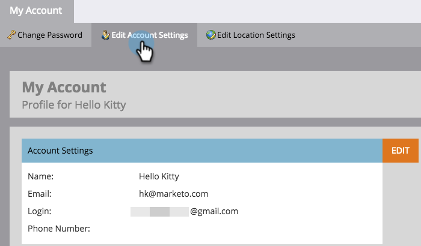

# Redigera kontoinställningar {#edit-account-settings}

Behöver du ändra kontots e-postadress, namn eller telefonnummer? Läs mer nedan.

>[!NOTE]
>
>**Administratörsbehörigheter krävs**

1. Gå till området **[!UICONTROL Admin]**.

   

1. Välj **[!UICONTROL My Account]**.

   

1. Välj **[!UICONTROL Edit Account Settings]**.

   

1. Gör dina ändringar och klicka på **[!UICONTROL Save]**.

   
