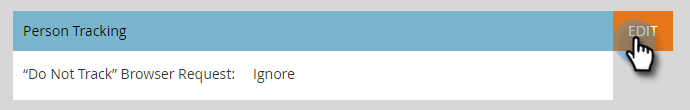

# Redigera inställningar för stöd för Do Not Track-webbläsare {#edit-do-not-track-browser-support-settings}

&quot;Do Not Track&quot; är en webbläsarbegäran som inte ska spåras i system som Marketo. Du kan följa den begäran med följande steg.

>[!NOTE]
>
>**Administratörsbehörigheter krävs**

>[!NOTE]
>
>&quot;Spåra inte&quot; kommer att anges till Ignorera som standard, så om det är det du vill ha behöver du inte vidta några åtgärder.

1. Klicka **Administratör**.

   

1. Klicka **Munchkin**.

   

1. Under **Personspårning**, klicka **Redigera**.

   

1. Välj **Support** och klicka **Spara**.

   

   När du har sparat ändringarna visas uppdateringen.

   

   >[!NOTE]
   >
   >Det bästa sättet är att stödja funktionen&quot;Spåra inte&quot;. I Europa är det lagen!

   >[!TIP]
   >
   >Mer information om Do Not Track (Spåra inte) och hur det fungerar finns på [den här sidan](https://en.wikipedia.org/wiki/Do_Not_Track).
