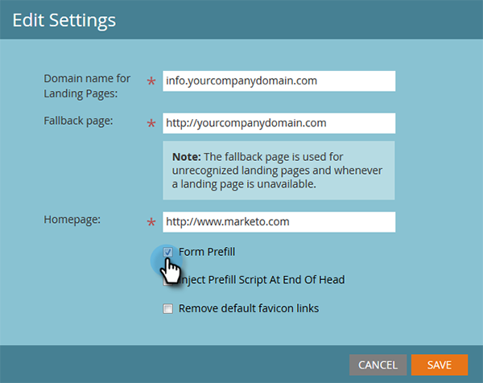

# Redigera inställningar för landningssida {#edit-landing-page-settings}

Du kan redigera ditt domännamn och din reservsida, aktivera eller inaktivera förifyllning av formulär, förhindra missbruk av din landningssida och mycket annat. Så här gör du.

>[!NOTE]
>
>**Administratörsbehörigheter krävs**

1. Gå till **[!UICONTROL Admin]** område.

   

1. Klicka på **[!UICONTROL Landing Pages]**.

   

1. I **[!UICONTROL Landing Pages]** avsnitt, klicka **[!UICONTROL Edit]**.

   

1. Ange domän- och sidinformation.

   

   | Villkor | Definition |
   |---|---|
   | [!UICONTROL Domain name for landing pages] | Det här är din CNAME. En CNAME är den första delen av den URL som du ger personer för landningssidor. Till exempel i `https://go.yourCompany.com`, ordet&quot;go&quot; är CNAME. Du kan ha flera, men de flesta använder bara den. |
   | [!UICONTROL Fallback page] | Det är här du ska gå om landningssidan inte finns eller är nere. Läs mer om [reservsidor](/help/marketo/product-docs/administration/settings/set-a-fallback-page.md). |
   | [!UICONTROL Homepage] | Ange företagets webbplats-URL. |

1. Kontrollera **[!UICONTROL Form Prefill]** kryssrutan för att tillåta formulär att förifylla information för kända (cookifyllda) personer. Avmarkera för att blockera.

   

   >[!NOTE]
   >
   >Om du vill ha förifyllningen `<script>` -tagg som ska visas i slutet av `<head>` -taggen i koden kontrollerar du **[!UICONTROL Inject Prefill Script at End of Head]** box. Låt alternativet vara avmarkerat om du vill att det ska visas i början.
   >
   >Kontrollera **[!UICONTROL Remove default favicon links]** för att förhindra att Marketo infogar några favoritikonlänkar i koden.

1. När du har gjort dina val klickar du på **[!UICONTROL Save]**.

   

   Snyggt jobb! Dina landningssidor har nu rätt information och bör börja fungera direkt.
