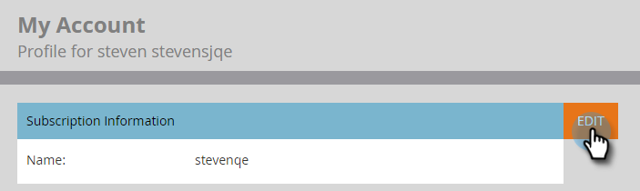

# Redigera prenumerationsinställningar {#edit-subscription-settings}

Om du har tillgång till flera Marketo-prenumerationer och vill vara säker på vilken du använder kan du prova att ge var och en av dem ett unikt namn. Namnet visas sedan högst upp på prenumerationssidan.

Om du till exempel arbetar i både produktion och i sandlådeinstanser kan du namnge en prenumeration **Marketo Production** och andra **Marketo Sandbox**.

1. Gå till **[!UICONTROL Admin]**.

   

1. Klicka på **[!UICONTROL My Account]**.

   

1. Klicka på **[!UICONTROL Edit Subscription Information]**.

   

1. Redigera och klicka **[!UICONTROL Save]**.

   
