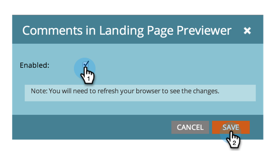

# Aktivera eller inaktivera funktioner för skatteschest {#enable-or-disable-treasure-chest-features}

Treasure Chest innehåller roliga experimentella funktioner som inte stöds fullt ut.

>[!NOTE]
>
>**Administratörsbehörigheter krävs**

1. Gå till **Administratör** område.

   

1. Klicka **Treasure Chest**.

   

1. Klicka **Redigera** för den funktion som du vill aktivera eller inaktivera.

   

1. Kontrollera **Aktiverad** om du vill aktivera eller avmarkera för att inaktivera, och klicka på **Spara**.

   

   >[!TIP]
   >
   >Du kan behöva logga ut och sedan logga in på Marketo igen för att se ändringarna börja gälla.
