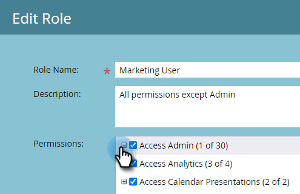
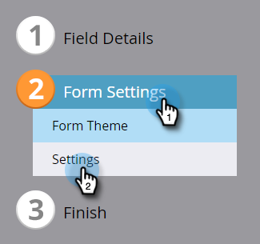

# Valideringsregler för globala formulär {#global-form-validation-rules}

Med den här funktionen kan du blockera specifika domäner från att skicka till Marketo Engage-formulär.

## Aktivera åtkomst {#how-to-enable-access}

Innan du kan använda den här funktionen måste du aktivera dess behörighet per önskad roll.

1. I Marketo klickar du på **[!UICONTROL Admin]**.

   

1. Klicka på **[!UICONTROL Users & Roles]**.

   

1. Klicka på **[!UICONTROL Roles]** -fliken.

   

1. Dubbelklicka på den roll du vill ge behörighet till.

   

1. Klicka på **+** -signering bredvid Access Admin.

   

1. Bläddra nedåt och markera **[!UICONTROL Access Form Validation Rules]** och klicka **[!UICONTROL Save]**.

   

## Skapa ny valideringsregel för formulär {#create-new-form-validation-rule}

>[!IMPORTANT]
>
>Dessa regler gäller för alla formulär i dina Marketo Engage-prenumerationer.

1. I Marketo klickar du på **[!UICONTROL Admin]**.

   

1. Klicka på **[!UICONTROL Global Form Validation Rule]**.

   

1. Klicka på **[!UICONTROL New Form Validation Rule]**.

   

   >[!NOTE]
   >
   >I listrutan Åtgärder för formulärverifieringsregel kan du ta bort eller redigera befintliga regler.

1. Ge regeln ett namn, ge den en valfri beskrivning och skriv felmeddelandet som du vill att formulärbesökarna ska se. Ange den eller de domäner du vill blockera i regelrutan, välj **[!UICONTROL Activate Rule]** och klicka **[!UICONTROL Create]**.

   

>[!NOTE]
>
>Marketo Engage har en definierad blockeringslista av kostnadsfria e-postdomäner för konsumenter som blockeras när vår förinlästa regel&quot;Blockeringslista för e-postdomän för konsumenter&quot; används. [Visa listan här](/help/marketo/product-docs/administration/settings/assets/freemaildomains.csv).

## Inaktivera åtkomst per formulär{#how-to-disable-access-per-form}

När det är aktiverat gäller reglerna alla formulär. Om du har ett formulär med specifika krav och du inte vill att något ska avvisas kan du inaktivera [!UICONTROL Global Form Validation Rules] i formulärinställningarna.

1. Klicka på **[!UICONTROL Form Settings]** sedan **[!UICONTROL Settings]**.

   

1. Klicka på **[!UICONTROL Global Form Validation Rules]** nedrullningsbar meny och välj **[!UICONTROL Disabled]**.

   

När du godkänner och publicerar formuläret kommer det att ignorera [!UICONTROL Global Form Validation Rules].
