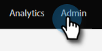

# Valideringsregler för globala formulär {#global-form-validation-rules}

Med den här funktionen kan du blockera specifika domäner från att skicka till Marketo Engage-formulär.

## Aktivera åtkomst {#how-to-enable-access}

Innan du kan använda den här funktionen måste du aktivera dess behörighet per önskad roll.

1. Klicka på **[!UICONTROL Admin]** i Marketo.

   

1. Klicka på **[!UICONTROL Users & Roles]**.

   

1. Klicka på fliken **[!UICONTROL Roles]**.

   

1. Dubbelklicka på den roll du vill ge behörighet till.

   

1. Klicka på **+** bredvid Åtkomstadministratör.

   

1. Rulla ned, markera **[!UICONTROL Access Form Validation Rules]** och klicka på **[!UICONTROL Save]**.

   

## Skapa ny valideringsregel för formulär {#create-new-form-validation-rule}

>[!IMPORTANT]
>
>Dessa regler gäller för alla formulär i dina Marketo Engage-prenumerationer.

1. Klicka på **[!UICONTROL Admin]** i Marketo.

   

1. Klicka på **[!UICONTROL Global Form Validation Rule]**.

   

1. Klicka på **[!UICONTROL New Form Validation Rule]**.

   

   >[!NOTE]
   >
   >I listrutan Åtgärder för formulärverifieringsregel kan du ta bort eller redigera befintliga regler.

1. Ge regeln ett namn, ge den en valfri beskrivning och skriv felmeddelandet som du vill att formulärbesökarna ska se. Ange de domäner du vill blockera i regelrutan, markera **[!UICONTROL Activate Rule]** och klicka på **[!UICONTROL Create]**.

   

>[!NOTE]
>
>Marketo Engage har en definierad blockeringslista av kostnadsfria e-postdomäner för konsumenter som blockeras när vår förinlästa regel&quot;Blockeringslista för e-postdomän för konsumenter&quot; används. [Visa den listan här](/help/marketo/product-docs/administration/settings/assets/freemaildomains.csv).

## Inaktivera åtkomst per formulär{#how-to-disable-access-per-form}

När det är aktiverat gäller reglerna alla formulär. Om du har ett formulär med specifika krav, och du inte vill ha något avvisat, kan du inaktivera [!UICONTROL Global Form Validation Rules] i formulärets inställningar.

1. Klicka på **[!UICONTROL Form Settings]** och sedan på **[!UICONTROL Settings]** i önskat formulär.

   

1. Klicka på listrutan **[!UICONTROL Global Form Validation Rules]** och välj **[!UICONTROL Disabled]**.

   

När du godkänner och publicerar formuläret kommer det att ignorera din [!UICONTROL Global Form Validation Rules].
