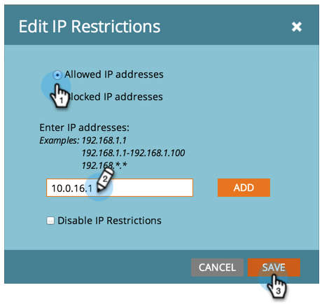

# Begränsa Marketo-inloggningar baserat på IP {#restrict-marketo-logins-based-on-ip}

Du kan begränsa eller göra det möjligt för användare att få åtkomst till Marketo baserat på deras IP-adresser. Så här gör du.

>[!NOTE]
>
>**Administratörsbehörigheter krävs**

>[!NOTE]
>
>Informationen i den här artikeln gäller endast för direkta inloggningar på login.marketo.com. Det är för närvarande inte möjligt att tillämpa IP-begränsningar för enkel inloggning (SSO).

1. Gå till **Administratör** område.

   

1. Klicka **Inloggningsinställningar**.

   

1. Klicka **Redigera IP-begränsningar**.

   

1. Välj om du vill **Tillåt** eller **Blockera** anger du adressen/adresserna och klickar sedan på **Spara**.

   >[!NOTE]
   >
   >**Definition**
   >
   >* **Tillåtna IP-adresser**: Tillåtna IP-adresser läggs till. Den kommer att innehålla alla angivna IP-adresser och utesluta allt annat.
   >* **Blockera IP-adresser**: Förhindrar att specifika IP-adresser får åtkomst till Marketo.
   >* **Inaktivera IP-begränsningar**: Om du kontrollerar detta kommer eventuella begränsningsregler att sluta fungera. Använd detta för testning.

   >[!NOTE]
   >
   >Du kan lägga till flera begränsningar, men de kan bara vara ALLA eller ALLA blockerade. Du kan inte blanda och matcha tillåtet och blockerat.

   

   Tack och lov är era marknadsföringsdata nu säkrare än någonsin!
