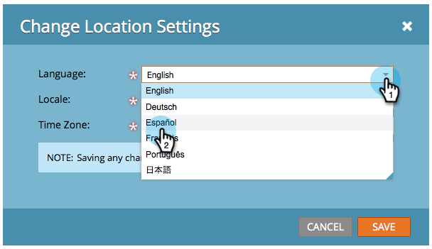

# Välj språk, språk och tidszon {#select-your-language-locale-and-time-zone}

Engelska är inte ditt första språk? Oroa dig inte, vi har dig täckt. Så här ändrar du språk, språkområde och tidszon.

## Språk som stöds {#supported-languages}

* Engelska
* Franska
* Tyska
* Japanska
* Portugisiska
* Spanska

## Ändra användarspråk, nationella inställningar och tidszon {#change-user-language-locale-and-time-zone}

1. Logga in på Marketo och välj **Mitt konto** under ditt namn.

   

1. Klicka på **Redigera platsinställningar** under Mitt konto.

   

1. Ändra **språk**.

   

   >[!TIP]
   >
   >Du kan också ändra enbart ditt språk genom att klicka på listrutan för språk högst upp på inloggningssidan.

1. Ändra din **språkversion**.

   

1. Ändra din **tidszon**.

   

1. Klicka på **Spara**.

   

Snyggt jobb! Webbläsaren uppdateras och du bör se ändringarna återspeglas.

