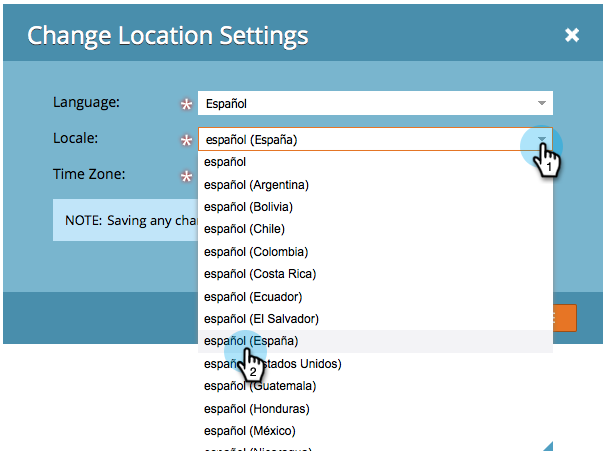

# Välj språk, språk och tidszon {#select-your-language-locale-and-time-zone}

Engelska inte ditt första språk? Oroa dig inte, vi har dig täckt. Så här ändrar du språk, språk och tidszon för din Marketo Engage-prenumeration.

>[!IMPORTANT]
>
>Om din Marketo Engage-prenumeration har migrerats till [Marketo med Adobe Identity](/help/marketo/product-docs/administration/marketo-with-adobe-identity/adobe-identity-management-overview.md){target="_blank"} gäller endast [tidszonen](#change-your-time-zone) i den här artikeln för dig. Om du vill ändra språk och/eller språkområde måste du komma åt dessa inställningar i din [Adobe-kontoprofil](https://account.adobe.com/profile){target="_blank"}.

## Språk som stöds {#supported-languages}

* Engelska
* Franska
* Tyska
* Japanska
* Portugisiska
* Spanska

## Ändra användarspråk, nationella inställningar och tidszon {#change-user-language-locale-and-time-zone}

Följ de här stegen för att gå till rätt område och välj sedan vilken inställning du vill ändra.

1. Gå till området **[!UICONTROL Admin]**.

   

1. Välj **[!UICONTROL My Account]**.

   

1. Klicka på **[!UICONTROL Edit Location Settings]** under Mitt konto.

   

### Ändra ditt språk {#change-your-language}

1. Klicka på listrutan **[!UICONTROL Language]** och gör ditt val.

   

   >[!TIP]
   >
   >Du kan också ändra enbart ditt språk genom att klicka på listrutan för språk högst upp på inloggningssidan.

### Ändra språkområde {#change-your-locale}

1. Klicka på listrutan **[!UICONTROL Locale]** och gör ditt val.

   

### Ändra din tidszon {#change-your-time-zone}

1. Klicka på listrutan **[!UICONTROL Time zone]** och gör ditt val.

   

## Spara {#save}

1. När du har ändrat inställningarna klickar du bara på **[!UICONTROL Save]**.

   

Så ja! Webbläsaren uppdateras och du bör se ändringarna återspeglas.
