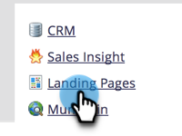

# Ange en återställningssida {#set-a-fallback-page}

Reservsidor är den sista försvarslinjen om landningssidan är offline eller inte hittas. Se till att du har en.

>[!NOTE]
>
>**Administratörsbehörigheter krävs**

1. Gå till **Administratör** område.

   

1. Klicka **Landningssidor**.

   

1. Under **Landningssidor** flik, klicka **Redigera**.

   

1. Ange **Reservsida** i dialogrutan och klicka på **Spara**.

   

Voilà! Du har just lagt till en reservsida! Inga fler 404 sidor.
