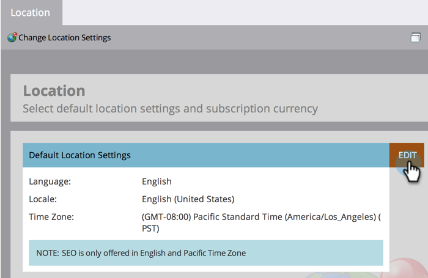
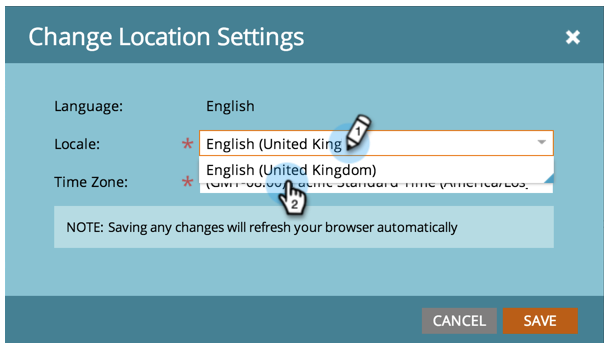
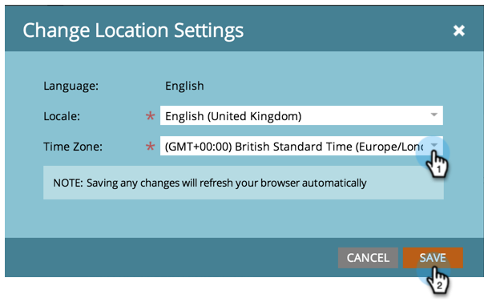

# Ange standardplatsinställningar för en prenumeration {#set-default-location-settings-for-a-subscription}

I den här artikeln beskrivs hur en administratör kan visa och redigera standardplatsinställningarna för en prenumeration, inklusive språk, språk och tidszon.

>[!NOTE]
>
>Administratörsrättigheter krävs. Språket är vanligtvis inte något som administratören skulle ändra. Den anges vid köptillfället så att prenumerationen kan genereras på rätt språk.

## Ange standardplatsinställningar för en prenumeration {#set-default-location-settings-for-a-subscription-1}

När en administratör ändrar standardplatsinställningarna ärver nyskapade användare dessa inställningar. Användare kan alltid [ändra sina inställningar för språk, språk och tidszon](/help/marketo/product-docs/administration/settings/select-your-language-locale-and-time-zone.md) i sina enskilda konton.

1. Gå till området **[!UICONTROL Admin]**.

   

1. Klicka på **[!UICONTROL Location]**.

   

1. Klicka på **[!UICONTROL Edit]**.

   

   Den här prenumerationen skapades på engelska. Säg att du var i London och ville ändra standardspråk och tidszon. Språkinställningen avgör formateringen för siffror, datum och tider.

1. Markera **[!UICONTROL Locale]** och ändra den till **[!UICONTROL English (United Kingdom)]**.

   

1. Välj sedan rätt **[!UICONTROL Time Zone]**.

   

   >[!NOTE]
   >
   >Marketo Sales Insight för [Salesforce.com](https://salesforce.com/) stöder franska, tyska, japanska, portugisiska och spanska.

## Ange standardvalutainställningar för en prenumeration {#set-the-default-currency-settings-for-a-subscription}

Om du ändrar standardspråkområdet för dina användare kanske du också vill ändra inställningarna för valutaformat.

1. Klicka på **[!UICONTROL Edit]** i [!UICONTROL Subscription Currency Settings].

   

1. Välj valfritt valutaformat och klicka på **[!UICONTROL Save]**.

   

   Grattis! Du har ändrat platsinställningarna för prenumerationen.

>[!MORELIKETHIS]
>
>* [Välj språk, språk och tidszon](/help/marketo/product-docs/administration/settings/select-your-language-locale-and-time-zone.md)
