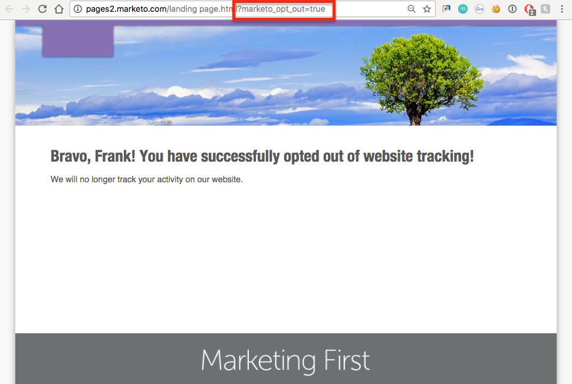

# Sekretessinställningar {#understanding-privacy-settings}

## Översikt {#overview}

Marketo ger marknadsförarna ett sätt att få webbbesökarnas samtycke att spåra dem. Det finns två sätt att avanmäla dig, eller så kan du välja att spåras med anonymiserad IP.

* Webbbesökare väljer funktionen Do Not Track (DNT) i sin webbläsare (och marknadsföraren följer webbbesökarens begäran om Do Not Track)
* Webbbesökare använder en avanmälningscookie som tillhandahålls av en marknadsförare på en webbplats

Marknadsföraren kan också spåra användare, men använda en anonym IP-adress.

Dessa metoder kan påverka Marketo värde och funktionalitet inom vissa områden. Om marknadsföraren _inte_ Om du ändrar något i Marketo konfiguration ändras inte Marketo funktioner.

## Webbläsarinställningar för Do Not Track {#browser-settings-for-do-not-track}

Webbbesökarna kan ställa in sin webbläsare så att de inte kan spåras av någon webbplats genom att välja&quot;Do Not Track&quot; (DNT). Detta förhindrar spårning för just den webbläsaren och enheten. Mer information finns i webbläsarens sekretessinställningar.

I [!DNL Munchkin], en marknadsförare kan [bestämma om webbläsarens DNT-inställning ska stödjas eller ignoreras](/help/marketo/product-docs/administration/settings/edit-do-not-track-browser-support-settings.md).

Marknadsförare kan avgöra om de ska [stöder eller ignorerar webbläsarens DNT-inställning](/help/marketo/product-docs/web-personalization/getting-started/setting-web-personalization-to-do-not-track.md).

## Avanmäl dig från en viss webbplats {#opt-out-from-a-specific-website}

Du kan också låta besökare välja bort webbplatsspårning från webbplatsen, oavsett om de vill eller inte **Webbläsaren spårar inte** inställningarna är konfigurerade. På så sätt kan besökaren ange sina spårningsinställningar direkt från webbplatsen.

För att kunna göra detta måste du lägga till en parameter i en länk för avanmälan på en webbsida som har [!DNL Munchkin] spårning är aktiverat. Det kan vara vilken webbsida som helst, men webbsidans länk måste innehålla följande parameter:

?marketo_opt_out=true

Nedan visas exempel på en webbsida med en länk för att avanmäla sig och en landningssida för när länken har klickats. Din kommer att variera.

Här är en webbsida med en knapp med parametern &quot;?marketo_opt_out=true&quot; i länken opt-out.

Du kan skapa och publicera en landningssida som en uppföljningssida för när du klickar på länken med parametern&quot;?marketo_opt_out=true&quot;.

När någon klickar på länken lägger Marketo till en cookie med namnet **mkto_opt_out** till besökarens webbläsare som inaktiverar [!DNL Munchkin] spårning för den besökare som klickar på länken med ovanstående parameter.

Verifiera att du är en cookie och klicka på länken för att bekräfta att cookien kan placeras. Kontrollera sedan webbläsarens cookies för att bekräfta att **mkto_opt_out** cookie har lagts till.

>[!NOTE]
>
>Detta fungerar för närvarande endast med [!DNL Munchkin] version 152 och senare.

## Anmäl dig {#opt-in}

Marknadsförarna kan ge användare möjlighet att anmäla sig genom att använda Marketo funktioner för e-post, formulär, landningssidor och andra metoder.

## Spåra med hjälp av en anonym IP {#tracking-using-an-anonymized-ip}

Marknadsförarna kan skydda sin integritet genom att spåra användare med en anonym IP-adress. Lägg till koden i RTP eller [!DNL Munchkin] Javascript som är inbäddat på webbplatsen.

* För [!DNL Munchkin]lägger du bara till {&quot;anonymizeIP&quot;,true} i init-funktionen.

  >[!NOTE]
  >
  >Om du använder den här parametern måste du [!DNL Munchkin] V2 måste aktiveras. Om du vill aktivera den för din prenumeration kontaktar du [Marketo Support](https://nation.marketo.com/community/support_solutions).

* För Webbanpassning (RTP) lägger du till detta i javascript-filen:

`anonymize IP : before calling rtp('send','view'); add rtp('set', 'settings', {'anonymizeIP' : true});`
