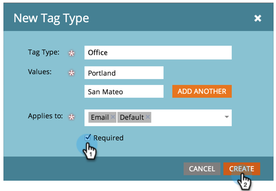

# Skapa en ny programtagg och taggvärden {#create-a-new-program-tag-and-tag-values}

>[!NOTE]
>
>**Administratörsbehörigheter krävs**

Du kan skapa egna [taggar](/help/marketo/product-docs/core-marketo-concepts/programs/working-with-programs/understanding-tags.md) för dina program och tilldela värden till taggen.

>[!NOTE]
>
>**Exempel**
>
>Programtagg: Målgrupp
>
>Programtaggvärde: SMB, Enterprise, Mid Market

1. Gå till **[!UICONTROL Admin]** område.

   

1. Klicka på **[!UICONTROL Tags]**.

   

1. Klicka på **[!UICONTROL New]** och välj **[!UICONTROL New Tag Type]**.

   

1. Ange **[!UICONTROL Tag Type]** och en tagg **[!UICONTROL Value]**. Klicka sedan på **[!UICONTROL Add Another]**.

   

1. Ange så många värden du behöver. Välj vilka programtyper du vill att den här taggen ska användas på.

   

   >[!TIP]
   >
   >Du kan välja flera programtyper. När ett nytt program skapas blir den här taggtypen tillgänglig.

1. Kontrollera **[!UICONTROL Required]** och klicka **[!UICONTROL Create]**.

   

   >[!NOTE]
   >
   >Om taggtypen är **[!UICONTROL Required]** måste användarna ange ett värde för taggen när de skapar ett nytt program.

   

När användarna skapar ett program måste de ange det anpassade värdet för den skapade taggen.
