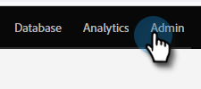

# Ta bort en programkanal {#delete-a-program-channel}

Programkanaler är en samling statusar eller kontrollpunkter som leads bör gå igenom i ett program.

Om du råkar göra en av misstag eller inte längre behöver en, kan du ta bort den.

1. Gå till **[!UICONTROL Admin]** område.

   

1. Klicka på **[!UICONTROL Tags]**.

   

1. Markera kanalen som du vill ta bort. I **[!UICONTROL Tag Actions]** nedrullningsbar meny, klicka **[!UICONTROL Delete]**.

   >[!TIP]
   >
   >Om kanalen är associerad med något program kan du inte ta bort, bara dölja.

   

Du kan också [ta bort specifika statusvärden från kanaler](/help/marketo/product-docs/administration/tags/delete-a-program-status-from-a-program-channel.md).
