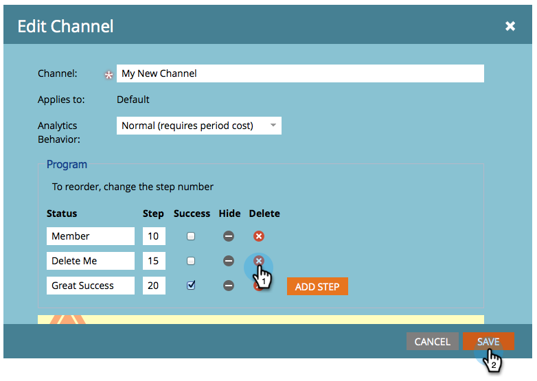

# Ta bort en programstatus från en programkanal {#delete-a-program-status-from-a-program-channel}

Programstatus är kontrollpunkter via en programsökväg (kanal). Om du gör en status av misstag eller inte längre behöver den kan du ta bort den.

1. Gå till avsnittet **Admin** .

   

1. Klicka på **Taggar**.

   

1. Markera den kanal som du vill ta bort en status från och klicka sedan på **Redigera** under **taggåtgärder**.

   

1. Klicka  för att ta bort statusen och klicka sedan på **SPARA**.

   >[!TIP]
   >
   >Om någon person för närvarande är tilldelad till den aktuella statusen kan du inte ta bort den, men du kan dölja den.

   

Snyggt gjort! Du kan också [ta bort en hel kanal](delete-a-program-channel.md) om det behövs.
