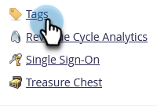

# Hantera taggvärden {#managing-tag-values}

[Taggar](/help/marketo/product-docs/core-marketo-concepts/programs/working-with-programs/understanding-tags.md) används för att beskriva program. Ni kan skapa så många ni behöver, var och en med unika värden. Så här hanterar du dessa värden.

>[!NOTE]
>
>**Administratörsbehörigheter krävs**

>[!PREREQUISITES]
>
>[Skapa en ny programtagg och taggvärden](/help/marketo/product-docs/administration/tags/create-a-new-program-tag-and-tag-values.md)

## Lägga till taggvärden {#adding-tag-values}

1. Gå till området **[!UICONTROL Admin]**.

   

1. Klicka på **[!UICONTROL Tags]**.

   

1. Klicka på **[!UICONTROL New]** och sedan på **[!UICONTROL New Tag Value]**.

   

1. Välj **[!UICONTROL Tag Type]**.

   

1. Ange en **[!UICONTROL Value]** och klicka på **[!UICONTROL Add Another]**. Du kan lägga till så många värden du vill.

   

1. Lägg till de återstående värdena och klicka på **[!UICONTROL Create]**.

   

Du borde se ändringarna direkt!

## Dölja taggvärden {#hiding-tag-values}

Taggar kan användas i äldre program. Du kan ta bort dem för framtida bruk genom att dölja taggtypen.

1. Markera **[!UICONTROL Tag]** och markera den **[!UICONTROL Value]** som du vill dölja.

   

1. Välj **[!UICONTROL Tag Actions]** under **[!UICONTROL Hide]**.

   

## Visa dolda värden {#show-hidden-values}

Om du vill se dina dolda värden igen gör du följande:

1. Markera kryssrutan **[!UICONTROL Show Hidden]**. När du har markerat det här alternativet kan du se det dolda värdet.

   

Du kan sedan visa de värden som du vill använda i framtiden.
